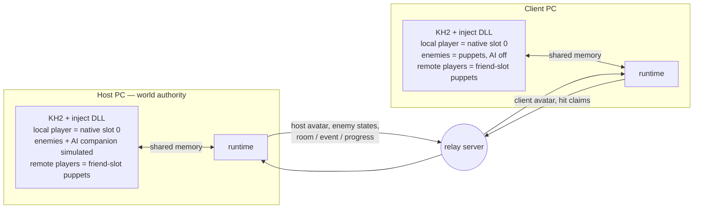
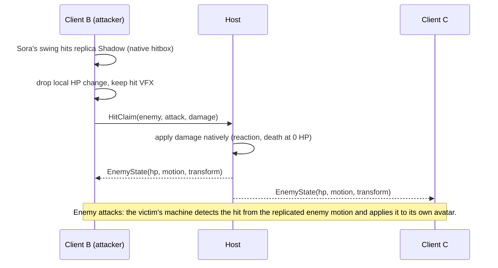

# Online Co-op Plan

> **Status:** proposed plan of record, 2026-10-01. Supersedes the Track A
> milestones M4–M8 in `IMPLEMENTATION_BACKLOG.md` and the authority and actor
> model sections of `kh2_three_client_coop_design.md`. Work is tracked in the
> Linear project **KH2 Multiplayer** (vuhlp workspace); this doc holds the
> design, decisions, risks and phase gates.

## Goal

Two or three players, each on their own PC with their own copy of KH2FM (Steam
Global), play together online: same rooms, same enemies, same story beats, each
with their own camera and full controls. Then widen who you can play as: three
recolored Soras first, then Roxas and Riku, party and world characters, and
possibly enemies.

## Where the project stands

| Area | State |
|---|---|
| Pointer map | Party transforms and HP, world/room/programs, camera, active-entity list, objentry ids. Enemy HP, spawn groups, death and AI are unmapped. |
| In-process hooks | MinHook DLL hooks the per-entity update, friend AI, pre-physics and the motion setter, and reads raw input. |
| Friend control | Donald moves and animates under player control (F5). He cannot attack, jump, guard or cast. |
| Animation control | Any motion can be set and held on a friend actor without the game resetting it (Session 5). |
| Network layer | ENet relay server, codec, version gate; the 3-client fake-simulation test passes. |
| Live networking | Never run end to end against a live game. |
| Rooms | World/room/program reads work; the transition request path is partly traced; no warp. |
| Dev loop | Every live step needs James: Cheat Engine injection, eyes on the screen, in-game setup. |

The hard parts (enemies, damage, transitions) are still ahead, and none of them
can be verified without a person at the PC. That ordering drives this plan.

## Prior art (researched 2026-10-01)

- **KH2 Online Coop** ([Expert595/kh2-multiplayer](https://github.com/Expert595/kh2-multiplayer),
  Sept 2026) is the closest match. Every player stays Sora locally; remote
  players are projected into the friend slots (transform written each tick,
  velocity zeroed, follow timer pinned, the vanilla motion reset blocked — the
  same techniques as this repo's Session 5 work). A native Sora is spawned in
  a companion slot by writing the playable-character selector into the world
  party table (save `+0x3534`) before a room load. It runs two local instances
  ("if Steam/Epic blocks the second launch, start the second KH2 process
  manually"). Scope by its own account: movement and independent rooms, not
  combat. External Python client, TCP/JSON relay, no license stated. It
  validates D3 and lowers R1/R2; its README also warns never to save while the
  replica slot is active.
- **OOT True Coop** (Ship of Harkinian fork, July 2026) is the closest match to
  the enemy plan, though built on decompiled source: a deterministic enemy key
  (room, spawn-order index, actor id, params), AI suppressed on clients with
  colliders kept, hit requests run through the enemy's own damage code, deaths
  delivered as synthetic lethal hits, local AI takes over if the host stream
  stops.
- **Archipelago KH2** is the most mature networked KH2 memory client: it
  re-asserts expected state every loop, gates writes on fade/load state (magic
  granted in a load zone crashes), moved death detection into a per-frame
  companion because polling missed deaths, and keeps per-version address
  tables. LuaBackend's Hook fork exists because scripts running outside the game
  loop caused crashes and wrong warps.
- **Shared enemies are where comparable projects stall.** ModLoader64's OoT
  Online never shipped them, HKMP took about 3.4 years, sm64coopdx is still
  fixing them object by object, and Skyrim Together's ownership bug lived four
  years. Nobody has synchronized blocking story cutscenes; projects make them
  local or drop the story.

Sources, the other projects surveyed (MTA:SA, SA:MP, BotW Multiplayer,
Seamless Co-op, Sekiro Online, SMO Online, Ship of Harkinian Anchor, Teamruns,
HKMP) and a pitfall list: `docs/research/PRIOR_ART.md`.

## Decisions

Format: decision — why (rejected alternative).

- **D1. Each player runs their own game; no lockstep.** KH2 has hidden timers,
  RNG and scripted state we can't make identical across machines (lockstep,
  rollback).
- **D2. Owner-authoritative avatars, host-authoritative world.** Each machine
  simulates its own player character natively and streams its state. The host
  machine simulates enemies, AI companions, rooms, events and story flags. We
  can't rewind or re-simulate KH2, so routing a player's input through the host
  would leave their own character a round trip behind their stick (host
  simulates all three players from forwarded input — the original design).
  Cheating isn't a concern among friends.
- **D3. Local-primary actor model** *(provisional until spike VUH-1489)*. On every
  machine the local human is the native player (slot 0) with all of Sora's
  systems — combos, magic, items, lock-on, camera, HUD — and no control RE.
  Remote humans appear as puppets in the friend slots, so three recolored Soras
  is the default roster. (Canonical slots — Sora on every machine, players 2
  and 3 as Donald and Goofy through friend AI replacement — need per-move friend action
  injection *and* a player-class puppet on every client, and make three Soras
  the hardest roster instead of the easiest.) The existing friend
  AI-replacement work becomes the puppet driver and, later, the route to
  playing party members and enemies.
- **D4. Hits are detected where they are seen; enemy HP lives on the host.** The
  attacker's machine detects its hits on replica enemies and sends a claim; the
  host applies the damage and decides deaths. The victim's machine detects
  incoming hits from replicated enemy attacks and applies them to its own
  avatar. Host-side detection of enemy→player hits is the fallback if
  replicated enemy motions don't produce hitboxes. The host always broadcasts
  absolute HP, never deltas (Skyrim Together's delta drift). (Host-side
  detection for everything — "I hit it and nothing happened" at every latency.)
- **D5. Enemies spawn natively everywhere, are matched by a deterministic key,
  and are shared in two steps.** The key is room + `btl` program + spawn-entry
  index + objectId, type-checked on every message. Step 1 shares only HP and
  deaths: every machine keeps its own enemy AI, attackers claim hits, and the
  host's deaths reach clients as synthetic lethal hits through the enemy's own
  damage routine, so the native death path (drops, wave counters, barriers,
  boss finishers) runs. Step 2 mirrors the host's enemy AI onto AI-suppressed
  client copies that keep their colliders — the OOT True Coop pattern. Step 1
  is a playable fallback if step 2 stalls, as shared enemies have in every
  comparable project. (Suppressing native spawns and spawning on command needs
  spawn-function RE; it stays the fallback if keys don't match.)
- **D6. One shared save for the MVP.** All players load the same co-op save,
  clients never save, and host progress is canonical. P2 adds runtime mirroring
  of host story state for drop-in play: an idempotent log of host flags,
  applied at room boundaries and re-applied after every load and death, as
  Archipelago does. (Merging different players' saves — out of scope.)
- **D7. The host leads transitions and cutscenes.** Client-initiated exits and
  event triggers are blocked; host room changes are replayed on clients with a
  forced warp; during host cutscenes clients hold behind an overlay, then
  resync. Synchronized cutscene playback is later work.
- **D8. Personal loot and EXP.** Each machine keeps its native drops and EXP;
  they aren't replicated. Story flags and world state are shared; inventories
  and levels are per player.
- **D9. Frame-accurate work lives in the DLL, at one write point, behind a
  state gate.** Avatar capture, puppet writes, damage interception and warps
  run in-process; the runtime process handles networking and orchestration
  through a shared-memory queue. A per-frame detour drains that queue at a fixed
  point in the frame, and a state gate (loading, fade, cutscene, menu, pause,
  controllable) holds writes that would land in a load zone or cutscene. Hooks
  install only after the target bytes match. (Cross-process writes race the game
  loop — why Strategy A puppeting failed, and why LuaBackend needed its Hook
  fork; Archipelago crashed granting magic in load zones.)
- **D10. The relay server stays; the host is whoever owns the world.** The
  existing ENet server is lobby and relay, run on the host PC or a small
  Tailscale/VPS node. No host migration: if the host leaves, the session ends.
- **D11. Public Realm and PvP stay parked** until the P4 playtest gate passes.
- **D12. Autonomy first.** P0 makes every later phase verifiable by an agent
  alone; live RE and gameplay work wait for it.

## Architecture

Hit resolution:

**Damage rule** (one hook, every machine): apply a hit when the victim is the
local avatar, or — on the host — when the victim is an enemy and the hit comes
from the host avatar, an AI companion, or a received claim. On a client, the
local avatar's hit on a replica enemy is dropped locally and sent to the host
as a claim. Drop every other hit: nothing a puppet does or suffers changes HP
locally.

## Hard problems

### 1. The autonomy rig (P0)

An agent needs to do alone what James does today: launch the game with the mod
loaded, get several instances into a known room, act, look, and judge.

- **Hands-free loading.** Launch KH2 suspended, inject, resume. This replaces
  the Cheat Engine step and runs our code before game init, which multi-instance
  support needs. A proxy-DLL loader is the packaging path for players (P4).
- **Several instances on one PC.** The exe imports `CreateMutexA`, so a
  single-instance lock is possible; early injection can rename it. Each
  instance also has to keep running unfocused, mute its audio, read only its
  own controller (the game merges every pad into slot 0), and accept scripted
  input through its PID-keyed mailbox, which already supports this. If 2–3
  instances can't run on one PC, autonomous multiplayer testing needs a second
  Windows machine — a hardware decision for James.
- **Eyes.** A swapchain `Present` hook in the DLL returns a screenshot of any
  instance on request, even when occluded, and carries a debug overlay. The
  same hook later draws the co-op HUD.
- **Fixtures.** A fixture is a save slot to load plus a warp target. The warp
  primitive (VUH-1486) also de-risks room transitions early. James's real save
  syncs to Steam Cloud: automation never writes it, and the DLL blocks in-game
  saving while automation runs.
- **Judgment.** A scenario runner executes launch → fixture → inputs → waits →
  memory assertions → captures, and writes a report plus artifacts. A crash
  produces a minidump and log bundle, not a hang.
- **Self-serve RE.** Most RE breakthroughs came from Cheat Engine data
  breakpoints (`LESSONS_LEARNED.md` §9). The DLL can provide the same: memory
  read/write/scan, hardware write-watch with a writer histogram, temporary
  function tracing, and calling game functions at a frame boundary. Headless
  Ghidra against the existing `kh2.gpr` provides decompile and xrefs without
  the GUI.

### 2. Puppets that look and move like the remote player (P1)

- **Binding.** Each machine maps remote avatars to friend slots 1–2. A puppet
  is hidden while its owner is in a different room.
- **Appearance.** The friend slot must render the remote player's character.
  Three known techniques, in the order to try them:
  1. Ask the game to spawn the player character as a companion: write the
     playable-character selector into a companion entry of the world party
     table in the save region before a room load (Expert595; the GoA ROM sets
     whole parties through the same save bytes). The game spawns a native Sora.
     Never save while it's active.
  2. Rewrite an objentry's model name before the room loads, as the GoA ROM
     does for party costumes — the route to recolored Soras.
  3. Replace the companion's model and moveset files, as Master-Trio does for
     keyblade Riku and Kairi.
  Don't remap a loaded actor's resources at runtime: Expert595 dropped that
  because it crashed during room teardown. The spike confirms the puppet plays
  Sora's motion ids cleanly.
- **Rooms without friend slots.** A room's `Party` opcode can force Sora-only
  (`NO_FRIEND`) or Donald-only layouts, and world guests take a slot. Remote
  players are hidden there unless a puppet can be spawned some other way.
- **Motion.** The owner streams motion id, motion time and transform every
  frame. The puppet sets the motion on change and corrects time drift, using
  the Session 5 guard that blocks the game's own per-frame resets. Motion
  triggers (VFX, SFX) should then fire natively — verify in the spike.
- **Transform.** Write the interpolated position and rotation after physics,
  zero the velocity, and keep friend follow-teleport and tether disabled. Check
  that a puppet far from Sora isn't culled or warped back.
- **Single-player assumptions.** Drive forms, limits and summons consume or
  animate party members. They're off in co-op until P4 decides otherwise.

### 3. Enemies on non-host machines (P3)

- **Correlation.** At room load the host sends a manifest keyed by room,
  `btl` program, spawn-entry index and objectId, plus spawn position. The
  client matches its natively spawned enemies with a position check. Later
  waves are matched incrementally as they appear. Mismatches are reported as
  desyncs.
- **Step 1: shared HP and deaths.** Every machine keeps its own enemy AI.
  Attackers claim hits; the host applies them and broadcasts absolute HP;
  clients hold each enemy's HP at the host's value. A host death reaches clients
  as a synthetic lethal hit through the enemy's own damage routine, so the
  native death path runs — death motion, despawn, drops, wave counters,
  barriers, and the finisher that `BOSS` objects need. Enemies stand in
  different places on each screen, but fights complete consistently.
- **Step 2: mirrored AI.** On clients, skip enemy AI in the per-entity update,
  keep the colliders, and drive transform, motion and HP from host state. The
  enemy class's vtable layout differs from the friend class and has to be
  mapped. If the host stream stops, local AI takes over.
- **Projectiles.** Enemy projectiles are spawned by AI, so clients won't see
  them unless they're replicated as spawn events. That needs the spawn function.
- **Bosses.** Validate per boss. Bosses built on reaction commands, scripted
  phases or arena changes come after common enemies work.

### 4. Damage and knockout (P3)

- **The damage boundary.** Find where a hit resolves: attacker, victim, attack
  params (atkp), position → HP change, reaction, invincibility, death. The
  route there is a write-watch on an enemy's HP in a mob fight, then its
  callers. The Axel session left HP candidates and a copy helper as leads.
- **Intercept and apply.** One hook enforces the damage rule. The same boundary
  must be callable to apply a claimed hit natively on the host and, as the
  fallback, a host-detected hit on a client's avatar.
- **Downed, not game over.** Every player is slot 0 on their own machine, so a
  local death would end their game (vanilla death reverts you to the last
  non-boss room). Lethal damage to the local avatar sets HP to 1 and enters a
  downed state. A teammate or a timer revives them. If the whole party is down,
  the host retries the room. Writing HP 0 alone doesn't kill Sora (Archipelago),
  so detection has to watch the damage path, every frame.

### 5. Rooms, cutscenes and story state (P2)

- **Warp.** Room changes are `Jump(world, area, entrance, localset, fade)` in
  the room scripts. The GoA ROM's `Warp` rewrites the `Now` block (world,
  room, door, map/btl/evt programs, defaulting the programs from the save's
  per-room table) — but it redirects a transition already in progress (from the
  world map); it doesn't start one. The `NOW` staging/commit path is traced
  (`pointer_map_v1.md`). The warp primitive needs a load trigger, loads
  (world, room, spawn, programs) on command, and reports when the room is
  playable.
- **Following the host.** Hook the transition request on the host, broadcast
  its location packet, and warp clients to it. On clients the same hook blocks
  any transition the host didn't command.
- **Cutscenes.** Detect host events; clients hold behind an overlay and resync
  afterwards, including any room change the event caused.
- **Progress.** At join and on change, mirror the host's story and world-state
  flags into the client's save region in memory, through a per-flag allow list,
  and block client saving (the open-menu indicator shows when the save menu is
  up). Synced flags don't update objects that are already loaded, so apply them
  at room boundaries first. Per D8, character stats and inventory aren't
  mirrored.

### 6. Playing as other characters (P5)

- **Colored Soras.** Recolor variants as puppet assets; each machine picks the
  variant for each remote player. A player sees their own Sora in vanilla
  colors unless they install their color locally.
- **Keyblade trio.** Community player-class swaps exist (Axel-Mix,
  Dual-Wield-Roxas, Vanitas), and Master-Trio puts keyblade characters into the
  friend slots. Roxas and Riku need a local player-class moveset plus a puppet
  asset each.
- **Party and world characters.** Either drive the friend-class actor with
  input (M3 friend control plus action injection), or author player-class
  movesets. A spike picks per character family.
- **Enemies and NPCs.** "Possession": replace an enemy's AI with input and map
  its attack actions. Exploratory.

### 7. Version drift and distribution

- Steam updates can move code. Every hook needs an AOB signature (some exist),
  and the version gate refuses mismatched builds.
- The package is an OpenKH-style mod (puppet objentries, recolors) plus our
  loader and DLL. Ship patches and recipes rather than extracted game files
  wherever possible.

## Risk register

| # | Risk | Likelihood | Impact | Retired by | Fallback |
|---|---|---|---|---|---|
| R1 | 2–3 instances can't run on one PC | Low–Medium (Expert595 runs two) | Autonomy | VUH-1484 | Second Windows PC/VM (James decides hardware) |
| R2 | A friend slot can't render and animate Sora's moveset | Low–Medium (Expert595 spawns a native Sora there) | D3 | VUH-1489 | Canonical slots plus friend action injection |
| R3 | Puppet motions don't fire VFX, SFX or hitboxes | Medium | Medium | VUH-1489, VUH-1500 | Effects as events; host-side hit detection |
| R4 | Enemy spawns differ between instances | Low–Medium | High | VUH-1499 | Host-commanded spawns (spawn RE) |
| R5 | Enemy AI can't be suppressed cleanly on clients | Medium | High | VUH-1500, VUH-1515 | Stay on enemy sync step 1 (local AI, shared HP and deaths) |
| R6 | The damage path can't be intercepted or called (claims and synthetic lethal hits both need it) | Low–Medium | High | VUH-1501 | HP writes plus reaction motions (cosmetic); kill-function RE for deaths |
| R7 | Forced warps are unreliable | Medium | High | VUH-1486 | Restrict to warp-safe rooms; menu-driven loads |
| R8 | Live save-region writes corrupt state | Medium | Medium | VUH-1495 | Shared save file only (D6) |
| R9 | Single-player assumptions break puppets (auto-warp, culling, drive and limits consuming party) | High | Medium | VUH-1491, VUH-1509 | Disable features in co-op |
| R10 | Latency makes combat feel bad | Medium | Medium | VUH-1492 | Tune interpolation; predict claimed hits |
| R11 | A game update moves offsets | Low | Medium | Ongoing | AOB signatures plus version gate |
| R12 | Rooms that force a Sora-only or guest party leave no friend slot for a puppet | Certain in some rooms | Medium | VUH-1491, VUH-1509 | Hide remote players there; spawned puppet actors later |
| R13 | Mirroring enemy AI stalls, as shared enemies have in every comparable project | High | Schedule | VUH-1500, VUH-1515 | Ship step 1 (shared HP and deaths, local AI); bosses one at a time |

## Phases and gates

Each phase is a Linear milestone. A gate is the evidence that closes it.

| Phase | Gate |
|---|---|
| **P0 Autonomy rig** | With no human: launch 3 instances, load a fixture, drive inputs, capture each instance, assert memory state, and reproduce the Session 5 writer finding with the self-serve probes. The suite passes 5 runs in a row and James's save is untouched. |
| **P1 Ghost co-op** | Three instances on loopback see each other's recolored Soras run, jump and attack in GoA for 10 minutes, with position error under 0.5 m at 100 ms simulated latency. James plays a remote session with a friend. |
| **P2 Shared world** | 20 host-led transitions across at least 5 rooms with 3 instances and no divergence. One cutscene hold and resume. A late joiner lands in the host's room. |
| **P3 Shared combat** | Three players clear a mob encounter and one boss — the same enemies on every screen — with matching enemy HP and deaths on every machine, no double damage, working downed/revive and no game over. James playtests. If mirrored AI (step 2) stalls, James decides whether to re-scope the gate to step 1. |
| **P4 Playable sessions** | A 2-hour remote session through one world with friends, installed from the package, with reconnect working and at most one manual resync. |
| **P5 Roster** | Each player picks a character (Sora color, Roxas, Riku, …) and every machine shows it correctly; one non-keyblade character is playable. |

Issues, with dependencies and acceptance criteria, live in Linear:

| Phase | Issues |
|---|---|
| P0 | VUH-1482 canonical checkout → VUH-1483 hands-free loading → VUH-1484 multi-instance spike, VUH-1485 capture/overlay, VUH-1486 warp, VUH-1487 RE probes → VUH-1488 scenario runner |
| P1 | VUH-1489 friend-slot Sora spike, VUH-1490 avatar capture → VUH-1491 puppet driver → VUH-1492 networked avatars → VUH-1493 internet → VUH-1494 playtest gate |
| P2 | VUH-1495 join flow → VUH-1496 host-led transitions → VUH-1498 cutscene hold; VUH-1497 progress sync |
| P3 | VUH-1499 spawn spike, VUH-1501 damage pipeline → VUH-1502 shared HP and deaths (step 1) → VUH-1503 hit authority; VUH-1500 enemy puppet spike → VUH-1515 mirrored enemy AI (step 2) → VUH-1505 projectiles; VUH-1504 downed/revive → VUH-1506 gate |
| P4 | VUH-1507 HUD, VUH-1508 reconnect/resync, VUH-1509 feature policy, VUH-1510 package → VUH-1511 gate |
| P5 | VUH-1512 colored Soras → VUH-1513 Roxas/Riku; VUH-1514 non-player-class spike |

Critical path: VUH-1482 → 1483 → 1484 → 1492 → 1495 → 1496, with VUH-1489 (the actor-model spike) gating the puppet work. The RE-heavy combat spikes (VUH-1499, 1500, 1501) can start as soon as the rig and probes exist, in parallel with P1–P2.

## Testing ladder

1. **Offline.** Codec and protocol tests plus `FakeSimulation`, and recorded
   avatar and enemy streams replayed through the protocol stack.
2. **One live instance.** Scenario runner with memory assertions and
   screenshots.
3. **Several instances on loopback.** 2–3 instances plus a local relay, with
   latency and loss injected in the transport so runs are repeatable.
4. **Remote.** James's PC and a friend's over Tailscale, at the P1, P3 and P4
   gates.

Tests follow stabilization (AGENTS.md): scenarios are the regression suite for
live behavior; unit tests cover stabilized boundaries such as the codec.

## Running autonomously

- **Lanes.** One live lane owns the game rig: every KH2 instance, the save
  safety rules and the rig lock. One or two offline lanes take network and
  protocol code, headless Ghidra analysis, tooling and docs. The rig is an
  exclusive resource in whichever fleet tooling runs the agents.
- **Work selection.** Follow the Linear milestone order and take unblocked
  issues first. An issue closes with evidence attached: the scenario report
  and media.
- **Human checkpoints.** Confirming D3 after VUH-1489; the playtest gates
  (VUH-1494, VUH-1506, VUH-1511); a hardware decision if R1 fails; any
  external account or infrastructure (relay VPS, public endpoint, publishing a
  mod).
- **Safety rules** (already in AGENTS.md; VUH-1488 adds the rig lock):
  - Never write James's save under `OneDrive/Documents/My Games/KINGDOM HEARTS
    HD 1.5+2.5 ReMIX/` (Steam Cloud syncs it), and never save in-game during
    automation.
  - Kill only KH2 processes the rig launched. A KH2 process the rig didn't
    start means James is playing — wait.
  - No public network exposure or third-party services without James.

## What carries over

| Existing piece | Fate |
|---|---|
| ENet relay, codec, session host, version gate | Kept. The protocol gains avatar, enemy manifest/state, claims, transitions and progress messages; the `ClientHello` handshake (old Track B2) lands with VUH-1492. |
| Inject DLL hook framework (per-entity update, AI skip, motion guard) | Becomes the puppet driver and the home of the damage and warp hooks. |
| `InputMailbox` | Grows into a two-way bridge: commands in, avatar and enemy telemetry out. |
| `kh2ctl` and its MCP wrapper | Grows into the launcher, scenario runner and probes. |
| `GameBridgePC` (cross-process reads/writes) | Reads and orchestration only; per-frame writes move into the DLL (D9). |
| `CameraController`, camera retarget | Not needed under local-primary; kept for debugging and spectating. |
| F5 friend control | Dev tool; the basis for playing party members (P5). |
| Server-side `SimulationState` | Test double only. |
| Tracks B–D (realm, PvP) | Parked (D11). |

## Open questions

| Question | Owner | Leaning |
|---|---|---|
| Actor model: local-primary (D3) or canonical slots? | VUH-1489 spike, then James | Local-primary |
| Enemy→player hits: victim-side or host-side detection? | VUH-1500 | Victim-side if puppet motions spawn hitboxes |
| Connectivity: Tailscale or a relay VPS? | VUH-1493, James for accounts | Tailscale for friends; VPS for anything public |
| Save policy after the MVP: a dedicated co-op save, or mirroring host story into each player's own save? | VUH-1495 | Dedicated co-op save; character import later |
| Drive, summons, limits: disable or support? | VUH-1509 | Disabled for the MVP; drive forms first after |
| Pause: does the host's pause stop the world, and does a client's stay local? | VUH-1509 | Host pause stops the world; a client's pause is local (their avatar stands still) |
| How a human plays a non-player-class character | VUH-1514 | Player movesets for keyblade wielders; friend control for party members |
