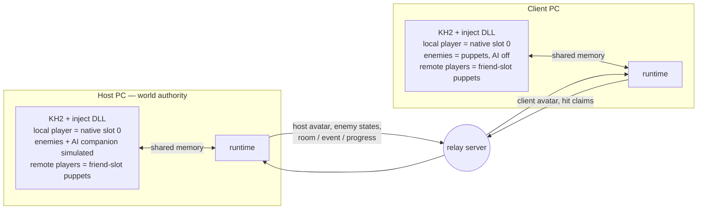
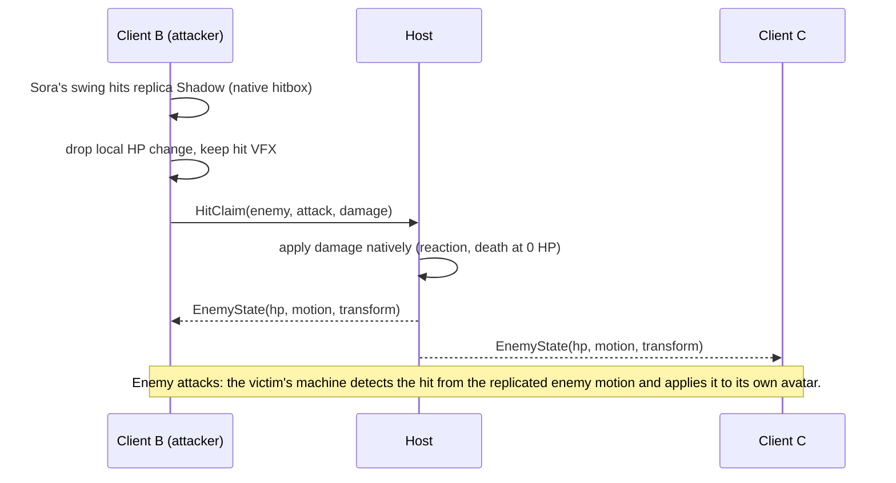

# Online Co-op Plan

> **Status:** proposed plan of record, 2026-10-01. Supersedes the Track A
> milestones M4–M8 in `IMPLEMENTATION_BACKLOG.md` and the authority and actor
> model sections of `kh2_three_client_coop_design.md`. Work is tracked in the
> Linear project **KH2 Multiplayer** (vuhlp workspace); this doc holds the
> design, decisions, risks and phase gates.

## Goal

Two or three players, each on their own PC with their own copy of KH2FM (Steam
Global), play together online: same rooms, same enemies, same story beats, each
with their own camera and full controls. Then widen who you can play as: three
recolored Soras first, then Roxas and Riku, party and world characters, and
possibly enemies.

## Where the project stands (updated 2026-10-04)

| Area | State |
|---|---|
| Pointer map | Party transforms/HP, full locations, camera, entity list, objentry IDs, enemy stats and the damage/death path are mapped. Spawn control and enemy AI suppression remain open. |
| In-process hooks | MinHook DLL hooks the per-entity update, friend AI, pre-physics and the motion setter, and reads raw input. |
| Friend control | Donald moves and animates under player control (F5). He cannot attack, jump, guard or cast. |
| Animation control | Any motion can be set and held on a friend actor without the game resetting it (Session 5). |
| Network layer | ENet relay server, codec, version gate; the 3-client fake-simulation test passes. |
| Live networking | Three live instances on loopback exchange avatars and shared enemy HP/deaths. Remote internet and controller playtests remain open. |
| Hit claims | Ordinary local-player HP hits publish typed claims; protocol v9 retains the v3 claim and v4 avatar shapes, v5 opaque session incarnation/typed closure semantics, v6 diagnostics, v7 absolute-HP ordering and v8 fresh resync transaction, adding exact ordinary-record content to native resync ([FORCED_RESYNC.md](FORCED_RESYNC.md)). The host consumes claims through byte-verified TakeDamage, with connection/sequence replay checks and fresh native census gates. Historical live results keep their original protocol scope. The current v9 candidate now has bounded local living-resync acceptance; broader combat, attack-specific effects and boss finishers remain open. |
| Rooms | Host-follow, late join and same-room reload passed 20 loads across five rooms with three instances, matching full locations, ACKs and native puppet targets. Native client exit denial and host walking exits also passed. After checked native snapshots exposed five unmatched client enemies, scoped host activation passed the original strict 20-load route with empty enemy populations and a source-expiry control. Its unchanged native-wave regression then failed with different enemy identities and an alive host refill. Nonempty spawn/lifecycle authority remains open. Evidence is in `SCENARIOS.md` and `ENEMY_PARITY.md`. |
| Shared progress | Masked native SAVE snapshots/deltas apply before client room initialization and hash actual bytes. A native host chest opening passed next-load client mirroring, late join and subsequent reload on three instances, with personal bytes preserved. A deliberate progress mismatch was detected and restoration verified. Broader story side effects remain open. |
| Dev loop | The desktop-session rig launches, injects, loads the fixture, drives inputs, captures each instance and checks save hashes without James. One live lane owns it; other lanes stay offline. |

Local scenarios now cover transitions, shared enemy HP/deaths and actual
nonempty enemy/progress hashes, plus chest progress mirroring and late join.
Broader hash agreement and story coverage, cutscene hold/resume, bosses and
remote playtests still gate the later phases.

The 2026-10-04 protocol **9** / WorldBridge **11** resync candidate has passed
bounded offline review and controls, plus an unchanged 89-step local living
Bootstrap in 201.7 seconds. Actual
capture/consumption requires coverage255 with the full ordinary native catalog
and exact current actor-to-record membership. Synthetic coverage127 remains in
the codec but is rejected by the native consumer. Whole catalog/population
preflight precedes HP/death writes; waiting/failed fences and exact-only binding
prevent positional fallback, and Checkpoint observes without HP/death repair.
Positive/max-HP guards and final context samples fail closed, with possible
partial application and unknown lethal outcomes retained as failures.

The current default-off recovery candidate replays the **actual host first-emission
float4** through one all-alive five-Shadow controller's normal scheduled original
update. Both `KH2COOP_SURVIVING_PACK_PREPARE=1` and `KH2COOP_SPAWN_TRACE=1` are
required. The recorder joins exact native input bytes to the update identity,
the first nonnull native wrapper return and normal update completion. The
receiver requires exact content and an empty fresh-load cache/census with native
counts5/5, flags2, cooldown0 and stage0. The observed host marker+E0 may match
client+E0/1 under the explicit reviewed normalization exception; neither marker
is rewritten. This is a deliberate historical-input policy, not replay equivalence.

The integrated optional HARP/v1 snapshot trailer is1128 bytes and SHA-covered;
legacy snapshot bytes stay unchanged, and historical metadata is excluded from
the native-state fingerprint. Historical input is bounded by512 actually
completed selected-controller original updates and the unchanged30s transaction
deadline. After exact full-set HP reconciliation, a120-completed-update hold
uses live host input and checks continued convergence. Claims stay held until
the whole selected set is reconciled. The64-slot per-controller completion
receipt table never evicts and fails unavailable on overflow. Expected selected
pending/deferred progress may wait within the same deadline; positive conflicts
fail. A fresh Bootstrap resets its transaction state, not owned-gateway tombstones.
See the [current policy and limits](FORCED_RESYNC.md#historical-activation-replay-current-default-off-policy).

The single-cycle98-step fixture is integrated, but its first two runs,
`20261004-132438` and `20261004-133512`, failed step81 `reconnect_mark` **before
reconnect**, in204.2s and200.9s; all four protected saves were unchanged. These
are observer/setup failures, not new recovery failures or acceptance. The
observer's hardcoded WorldBridge10 check conflicted with current11. The exact
version correction is integrated and passes the evidence/runner controls. Run
`20261004-134727` passed the93 original steps with5/5/5, then failed the added
replay-verification wait: automatic cached-world rejoin never starts the explicit
ResyncPlan that carries this candidate. All three opt-ins were enabled, but no
replay ran. The98-step fixture and its repeat derivative are held. The separately
named farther control143318 passed all120 steps with two complete5/0/5 samples
and sampled host endpoints outside all seven BOXes. Forced experiment143903
then passed all142 steps: one Friend1 Bootstrap, actual host first-emission
point,33 completed historical updates and120 completed live-input updates,
reconciled1 and two complete5/5/5 samples atHP17/max20. All four saves and98
sealed inputs stayed unchanged in both runs. This qualifies only the bounded
forced route. The unchanged forced regression155707 on commitf10b0d4
subsequently failed outside-position setup at step92,206.5s, before Friend1
rejoin or any forced request: native Z365.722 missed450<Z<600. All four saves
were unchanged and owned cleanup completed. Recovery was not exercised. A
bounded native pulse/read movement candidate is under separate qualification;
no geometry or population gate is relaxed. The host-owned enemies-DesyncNotice
path is now integrated and
remains default-off: it requires exact `1` for `KH2COOP_AUTOMATIC_RECOVERY`,
`KH2COOP_SURVIVING_PACK_PREPARE` and `KH2COOP_SPAWN_TRACE`. It uses the existing
request generator, one combined requested/plan busy guard, captured-context
dedupe and two pending friend slots. Pending work drains only after a terminal,
with full context revalidation and current runtime ownership checks; it adds
no retry or deadline reset.

Independently of that opt-in, the generic client generation boundary now holds
**all outgoing client hit claims** until the complete admitted living manifest
has unique full native census coverage and actual HP/maxHP readback equality.
Unknown/empty universes stay held; scope or manifest/HP changes rearm the hold.
Keyed replay/claim, runtime cause and native load receipts plus interval seals
support bounded attribution; unavailable identities and log gaps remain explicit.
The full Release build and **2,298 affected offline checks pass**, including
59 notice/generator, 44 claim-hold, 66 load-receipt and 365 canonical native-hit
checks. The [combined receipt](../build/rig/automatic-recovery-root-integration-20261004-01/cpp-validation.json)
retains executed results; private sanitizer checks are scoped separately.
The first combined build failed on a test adapter declaration; the corrected
explicit-argument calls retain all assertions and pass the final build/run.
The original and forced-outside ten-cycle gates remain open. James approved the
separate v2 contract on2026-10-04 (VUH-1508 comment7ca6ae56):10/10 natural or
resynced cycles for the original route, and10 resynced cycles for the outside
variant. A natural outside cycle fails without a skip or retry; every other
classification fails. v1 and historical FAILs remain unchanged. Approval does
not qualify the private validator or a live run. The earlier first-rejoin5/0/5 failure and zero completed
ten-cycle acceptance remain. General deaths/waves and battle/barrier/music parity
remain unqualified.

The earlier, default-off surviving-pack preparer remains integrated. It
retains the five-record intent/pending outcomes and cancels on covered native
controller mutation or material post-cut authority changes; it never dispatches
native creation. Three entry hooks provide synchronous negative cancellation,
not incarnation or foreign-creator exclusion. A later unchanged89-step native
run passed with the opt-in enabled, verifying installed hooks and sampled
occupancy without added creation or first-rejoin recovery acceptance. See
[preparation contract and limits](FORCED_RESYNC.md#surviving-pack-preparation-2026-10-04).

The later occupancy reader/receiver join now retains sampled active/deferred,
full-cache and controller facts, with exact ready membership and current-room
cache checks. It passed115 reducer,324 receiver and347 reader controls in
Windows ASan, with a successful full Release build. In the196.8s native run,
both receivers retained empty/pending/partial samples before ordinary spawning
reached five-ready/masks31 and exact HP20-to17 reconciliation. Global pre-link
creator coverage and native execution authority remain missing in every sample.
The script-handler owner has a concrete normal scene path, while immediate
script reentrancy and continuous creator exclusion still hold added dispatch.

**Parked alternative: added emitter calls, B1 creator admission and loader-owned
branch installation.** The following proof and control results remain historical
evidence for that route; they are not prerequisites for the current original-update
input policy, and the gateway/branch installer stays off.

Finite saved-code review proves an object302-capable script factory ingress
outside both observed record wrappers. It also shows that a null wrapper return
can advance to another record before the emitter returns. An added-dispatch
alternative would need creator admission through record/cache attachment and
a stop before later owned attempts inside that loop. Its candidate spatial bypass is the actual
taken no-region branch, with native cooldown and truthful bit3clear semantics;
historical constructor replay and complete resource logging are not intrinsic
requirements. The private A/B/C component now has independent copied-native
Release and Windows ASan replays, each with426 passing checks. Its versioned
finite generator/POD is included in the inject target and independently passes
455 checks in each configuration; installation and production execution remain
unqualified. The internal direct gateway and default-off retained preparation
are now compiled into the inject target:512/460 Release and Windows ASan controls,
with independent28/40-assertion native boundary checks. The actual linked MASM
body and unwind metadata match the tested gateway. There is no production caller
or branch writer. A closed patch-admission interval and continuous creator
ownership remain missing; the selected synchronous scene owner also needs
qualified reentrant callbacks and prior creator retirement. Blanket null denial
remains unsafe for secondary allocation and
consumes VM intent.552430's unsafe return ABI is byte-verified, but no saved
direct/literal caller or export was established; it is not a proven live ingress.
The installed Shadow BDX is now decoded: its explicit leave decision uses global
flags, distance and culling, with no accepted-region query in the exact asset.
Loaded binding, auxiliary action slots and outside-region liveness remain open.
The default-off current-secondary diagnostic now passes14 steps in153.4s.
Independent saved-byte replay verifies522 current slot results across three
peers, none returning raw302. This binds current relocated tables and equipment
selections; future arguments, actor ownership and continuous creator exclusion
remain open. Parent living counts are0/0/0, so no activated Shadow pack,
recovered enemies or cleared creation gate follows. See the
[native current-selection review](../build/rig/native-secondary-bindings-native-independent-review-20261004-01/review.md).
See the [parked execution boundaries](FORCED_RESYNC.md#parked-added-dispatch-b1-and-loader-installation-route).

A default-off natural-construction/resource observer is now integrated in the
candidate. It copies actual wrapper ancestry and full definition samples, then
records the specific byte-qualified package callback `107240` without changing
its native call. The shared Release and Windows ASan targets passed387 spawn,
63 resource and365 consumer checks each. Its corrected MinHook trampoline and
process-lifetime retention have independent offline reviews. An unchanged
89-step native run passed in203.8s with actual byte-qualified/pinned observers
on all three instances. It retains90 callback receipts per peer joined to the
selected five-record definition; later friend reload children were suppressed
by the512-receipt budget and remain unqualified. This diagnostic supplies
bounded resource evidence and adds no creation authority. See
[observer scope and limits](FORCED_RESYNC.md#surviving-pack-preparation-2026-10-04).

Release and Windows MSVC ASan each passed **154 common**, **276 reader/trace**,
**257 wire** and **272 consumer** executed checks, including repeated setup
checks. The [current candidate evidence table](FORCED_RESYNC.md#native-record-content-candidate-2026-10-04)
links exact receipts and independent READY reviews. These are not independent
native scenarios. The preserved first-rejoin population FAIL, zero completed
ten-cycle repetitions, disabled creation, and open lifetime/pending/creator
closure remain. In the new native run, both original friends loaded3 to4 and
each corrected five fresh native HP20 values to17 under exact record-content
qualification, followed by two distinct actual HP17 observation frames and
fresh independent census/hash joins. Full host/local catalogs contain10
definitions/26 records; matching relay and host-runtime terminals corroborate
the result. All101 inputs/four saves match and all8 owned processes exited.
Progress apply changed zero bytes, positive geometric stability is unclaimed,
and automatic collection remains aggregate-partial (cadence1).
See the [bounded native result](FORCED_RESYNC.md#native-record-content-candidate-2026-10-04).

## Prior art (researched 2026-10-01)

- **KH2 Online Coop** ([Expert595/kh2-multiplayer](https://github.com/Expert595/kh2-multiplayer),
  Sept 2026) is the closest match. Every player stays Sora locally; remote
  players are projected into the friend slots (transform written each tick,
  velocity zeroed, follow timer pinned, the vanilla motion reset blocked — the
  same techniques as this repo's Session 5 work). A native Sora is spawned in
  a companion slot by writing the playable-character selector into the world
  party table (save `+0x3534`) before a room load. It runs two local instances
  ("if Steam/Epic blocks the second launch, start the second KH2 process
  manually"). Scope by its own account: movement and independent rooms, not
  combat. External Python client, TCP/JSON relay, no license stated. It
  validates D3 and lowers R1/R2; its README also warns never to save while the
  replica slot is active.
- **OOT True Coop** (Ship of Harkinian fork, July 2026) is the closest match to
  the enemy plan, though built on decompiled source: a deterministic enemy key
  (room, spawn-order index, actor id, params), AI suppressed on clients with
  colliders kept, hit requests run through the enemy's own damage code, deaths
  delivered as synthetic lethal hits, local AI takes over if the host stream
  stops.
- **Archipelago KH2** is the most mature networked KH2 memory client: it
  re-asserts expected state every loop, gates writes on fade/load state (magic
  granted in a load zone crashes), moved death detection into a per-frame
  companion because polling missed deaths, and keeps per-version address
  tables. LuaBackend's Hook fork exists because scripts running outside the game
  loop caused crashes and wrong warps.
- **Shared enemies are where comparable projects stall.** ModLoader64's OoT
  Online never shipped them, HKMP took about 3.4 years, sm64coopdx is still
  fixing them object by object, and Skyrim Together's ownership bug lived four
  years. Nobody has synchronized blocking story cutscenes; projects make them
  local or drop the story.

Sources, the other projects surveyed (MTA:SA, SA:MP, BotW Multiplayer,
Seamless Co-op, Sekiro Online, SMO Online, Ship of Harkinian Anchor, Teamruns,
HKMP) and a pitfall list: `docs/research/PRIOR_ART.md`.

## Decisions

Format: decision — why (rejected alternative).

- **D1. Each player runs their own game; no lockstep.** KH2 has hidden timers,
  RNG and scripted state we can't make identical across machines (lockstep,
  rollback).
- **D2. Owner-authoritative avatars, host-authoritative world.** Each machine
  simulates its own player character natively and streams its state. The host
  machine simulates enemies, AI companions, rooms, events and story flags. We
  can't rewind or re-simulate KH2, so routing a player's input through the host
  would leave their own character a round trip behind their stick (host
  simulates all three players from forwarded input — the original design).
  Cheating isn't a concern among friends.
- **D3. Local-primary actor model** *(confirmed by James 2026-10-02 after VUH-1489)*. On every
  machine the local human is the native player (slot 0) with all of Sora's
  systems — combos, magic, items, lock-on, camera, HUD — and no control RE.
  Remote humans appear as puppets in the friend slots, so three recolored Soras
  is the default roster. (Canonical slots — Sora on every machine, players 2
  and 3 as Donald and Goofy through friend AI replacement — need per-move friend action
  injection *and* a player-class puppet on every client, and make three Soras
  the hardest roster instead of the easiest.) The existing friend
  AI-replacement work becomes the puppet driver and, later, the route to
  playing party members and enemies.
  **Flexible parties (James):** each party slot can be a remote player,
  Donald, Goofy, the world ally or empty, set per session through the world
  party table (VUH-1519). That covers everyone in one party, players replacing
  NPCs, no NPCs, and solo play. Keeping your own NPC party while joining
  someone else's world needs more actors than KH2 has slots; that's a stretch
  goal.
- **D4. Hits are detected where they are seen; enemy HP lives on the host.** The
  attacker's machine detects its hits on replica enemies and sends a claim; the
  host applies the damage and decides deaths. The victim's machine detects
  incoming hits from replicated enemy attacks and applies them to its own
  avatar. Host-side detection of enemy→player hits is the fallback if
  replicated enemy motions don't produce hitboxes. The host always broadcasts
  absolute HP, never deltas (Skyrim Together's delta drift). (Host-side
  detection for everything — "I hit it and nothing happened" at every latency.)
  The initial automatic path accepts ordinary HP damage only: direct native
  ownership must resolve to the canonical local player; healing types, applied
  records, NPCs and remote clones cannot publish. Protocol v3 binds claims to
  the relay's current connection ID, monotonically increasing sequence,
  announced epoch, netId and objectId. Rejoining gets a new connection ID;
  runtime roster changes retire queued claims before native application.
  The host consumes a sequence before one native attempt and recaptures the
  checked census afterward. This invokes TakeDamage with a negative HP delta;
  it does not replay attack parameters or establish boss finisher/survival
  semantics. Current checked metadata reduces stale-pointer risk without
  proving native creation identity; D5 retains that unresolved boundary.
  Native courtyard acceptance now covers 22 uniquely applied client claims,
  including three ordinary Shadow kills delivered once to both clients, with
  matching applied HP/population/progress hashes. This is bounded D4 evidence;
  victim-side enemy attacks, boss finishers and general wave parity remain open.
  See [native claim acceptance](SCENARIOS.md#automatic-client-hits-native-courtyard-acceptance-2026-10-02).
  A default-off passive hit observer is now verified offline, joining current
  session and canonical victim facts to genuine nested adjusted damage and
  checked HP. The observer itself changes no damage policy. A separate active
  HP ownership gate is now implemented and verified offline: supported remote
  victims/sources and unknown sources are suppressed; host enemy damage needs
  a canonical host avatar or positively observed native companion; ordinary
  canonical client attacks retain the single claim-before-zero path. The native
  call and hit consumption remain intact. Fresh-client incoming-hit validation,
  native puppet-veto acceptance and step-2 replicated hitboxes remain open;
  see [incoming acceptance](SCENARIOS.md#incoming-player-damage-remaining-acceptance).
  The opt-in hit trace now also records the actual ownership decision, three
  roster IDs, claim result, revalidation and checked-zero outcome in its bounded
  scope. A separate offline audit can verify checked noncanonical type-0 zero
  scopes without treating them as incoming-damage witnesses or authenticated
  remote membership. Native callback and gameplay acceptance remain unverified.
- **D5. Enemies spawn natively everywhere, are matched by a deterministic key,
  and are shared in two steps.** The key is room + `btl` program + spawn-entry
  index + objectId, type-checked on every message. Step 1 shares only HP and
  deaths: every machine keeps its own enemy AI, attackers claim hits, and the
  host's deaths reach clients as synthetic lethal hits through the enemy's own
  damage routine, so the native death path (drops, wave counters, barriers,
  boss finishers) runs. Step 2 mirrors the host's enemy AI onto AI-suppressed
  client copies that keep their colliders — the OOT True Coop pattern. Step 1
  is a playable fallback if step 2 stalls, as shared enemies have in every
  comparable project. (Suppressing native spawns and spawning on command needs
  spawn-function RE; it stays the fallback if keys don't match.)
  The current candidate passes first-pack native HP/deaths with complete typed
  censuses, but its latest diagnostic had an empty second wave and controller
  count two. General spawn convergence, multi-wave barriers and boss finishers
  remain open; preserve the earlier strict divergence alongside this bounded pass.
  Offline surviving-population review (2026-10-03) narrows the fallback to a
  fresh, complete snapshot-defined living set, with an exact portable native
  record map and separate current source/target controller incarnations. It
  need not replay historical constructor events. Manifest observation order,
  a bare actor address, count equality or an empty ready-enemy census cannot
  certify native enrollment or exclude pending actors/reinitialization.
  The actual type2 dispatcher runs the full native emitter, but the five fixed
  records each have delay8: one call can emit at most one successful record,
  and AL1 also permits zero/partial creation. A candidate must retain original
  native cooldown progression across bounded ticks; direct dispatch omits
  outer event/disabled gates and accepted-region flag handling. No count/cache,
  flag or geometry patch establishes that missing equivalence. The current
  historical-input policy uses the separately recorded host first-emission input;
  it claims bounded convergence, not original replay equivalence.
  Fifteen recorded nonnull AllocationPassed returns were immediately
  actor-read-unavailable, with thirty later complete-census correlations.
  Unavailable default zeros are not observed native zeros or death, and later
  same-address matches do not prove continuous allocation lifetime. Fresh
  enrollment/pending witnesses, actual eligibility/flag semantics, partial
  outcomes and ordered post-cut death handling remain unproved. This is an
  historical offline candidate assessment, not validation of an implemented recovery operation or a
  general wave/empty-room solution (`SCENARIOS.md`).
  Follow-up saved-data replay establishes all thirty full64-byte native records
  are equal across the six setup peer observations (array SHA447e6d0f...d660df),
  with actual actor/binding joins to IDs11,12,13,14,18. It does not supply raw
  full headers, relocation diversity or the failing load7's definitions.
  Those missing-header/load observations belong to the earlier setup replay.
  The later `20261004-020622` diagnostic captures all 26 ordinary records in
  all 36 samples, including the failing load, with complete combined scope in
  both empty Friend1 observations; global/lifetime/pending proof stays open.
  Saved-PE review resolves the event gate: 3ABC80 is read-only/no-argument;
  nonzero AL blocks and AL0 permits native cooldown/region work. The later run
  records 55 genuine gate AL0 returns and seven BOX AL0 returns per invocation
  within its conditional original-thread bracket. Finalization atomics and fiber
  continuity remain unproved. Independent saved-code/list review confirms those
  BOX AL0 returns bypass the sole ordinary dispatcher call and exhaust the
  seven-node loop; it does not exclude other invocations or creators. Continuing
  to replay that sampled point cannot reconstruct the surviving pack through
  this path. Exact portable record-content comparison and native catalog capture
  are accepted offline for the host-commanded fallback. The new protocol9
  native living Bootstrap qualifies all10 definitions/26 records and corrects
  five native HP20 values to17 on each original friend, with later checked
  HP17 observations. Absent-pack reconstruction remains open and creation
  stays disabled.
  Accepted-region bit3 has NPC and script
  consumers; the verified Shadow handler is distinct. An outside-region living
  intent may truthfully retain bit3clear, but its supported actor/script/lifetime
  semantics must be proved instead of copying an accepted-path flag.
- **D6. One shared save for the MVP.** All players load the same co-op save,
  clients never save, and host progress is canonical. P2 adds runtime mirroring
  of host story state for drop-in play: an idempotent log of host flags,
  applied at room boundaries and re-applied after every load and death, as
  Archipelago does. (Merging different players' saves — out of scope.)
- **D7. The host leads transitions and cutscenes.** Client-initiated exits and
  event triggers are blocked; host room changes are replayed on clients with a
  forced warp; during host cutscenes clients hold behind an overlay, then
  resync. Synchronized cutscene playback is later work.
- **D8. Personal loot and EXP.** Each machine keeps its native drops and EXP;
  they aren't replicated. Story flags and world state are shared; inventories
  and levels are per player.
- **D9. Frame-accurate work lives in the DLL, at one write point, behind a
  state gate.** Avatar capture, puppet writes, damage interception and warps
  run in-process; the runtime process handles networking and orchestration
  through a shared-memory queue. A per-frame detour drains that queue at a fixed
  point in the frame, and a state gate (loading, fade, cutscene, menu, pause,
  controllable) holds writes that would land in a load zone or cutscene. Hooks
  install only after the target bytes match. (Cross-process writes race the game
  loop — why Strategy A puppeting failed, and why LuaBackend needed its Hook
  fork; Archipelago crashed granting magic in load zones.)
- **D10. The relay server stays; the host is whoever owns the world.** The
  existing ENet server is lobby and relay, run on the host PC or a small
  Tailscale/VPS node. No host migration: if the host leaves, the session ends.
  **Hosting is Minecraft-style (James, 2026-10-02):** the host runs the relay
  next to their game and friends join by address; no central service.
  Friends reach the host over Tailscale (first test) or, if the host chooses,
  a forwarded UDP port (VUH-1493).
  The relay now removes all old co-op connections on clean host departure or
  heartbeat expiry, clears cached world/progress state and keeps listening for
  fresh joins. Headless loopback teardown/rejoin controls cover this boundary;
  Each accepted Player lifetime now mints an opaque OS-random world incarnation;
  the configured session name is only a label. The v5 client pins that token
  and the original host connection/peer before bounded friend-only rejoin.
  A changed host or restarted relay is terminal. Initial failure and Player
  loss never auto-retry. Separate transport/roster deadlines and five attempts
  within 60 seconds bound recovery; ten uninterrupted seconds of admitted
  membership reset the budget, without claiming native readiness. Current WorldBridge
  v11 retains v8's retirement before a delayed reset and rejects outgoing
  records carrying a retired producer generation. Native gameplay recovery and
  remote reconnect remain open (`SCENARIOS.md`). The relay now admits cached
  hold/manifest/HP/death only for the current nonzero room epoch, with complete
  exact frames; HP/death also require the current manifest. Frozen-baseline
  controls reproduced stale-cache relabeling and the fixed cache passes offline.
  Protocol 7 introduced the retained nonzero 64-bit DLL-produced HP sequence; relay and
  client/native floors prevent older same-room health from rolling back newer
  values. Reliable equal-sequence cache replay remains supported. The source
  counter survives room/application changes and never wraps (`HP_ORDERING.md`).
  Protocol 8 introduced fresh checked host capture, immutable targets,
  source/delivery fencing, complete staged bootstrap and distinct native
  convergence ACKs, with one non-reloading Checkpoint. The operator uses a
  separate CAS mailbox; queued is not success. Cancellation unarms native
  authority and lazy attachment retains bounded post-cut continuation. The
  current versions are protocol 9 / AvatarBridge 2 / WorldBridge 11 /
  Capture 1. Protocol 9 adds the full record-content witness and guarded native
  consumer described above; its bounded local living Bootstrap passed, while
  absent-pack reconnect recovery remains open.
  The relay defaults to native traffic; `--simulate` is explicit legacy mode.
  Offline controls pass. Historical protocol-8 local empty-room and five-Shadow
  living-only Bootstrap convergence have native receipts. A separate unchanged 89-step fixture
  also repaired one deliberately injected Friend1 shared progress bit through
  a recorded one-byte native apply, without cleanup writing; four protected
  saves stayed unchanged. These bounded local results do not establish general
  HP/death/progression or physical remote acceptance ([FORCED_RESYNC.md](FORCED_RESYNC.md)).
  Additive runtime identity logs and an existing-only `avatarctl observe`
  command now expose connection/generation/provenance observations. A strict
  93-step same-process Friend1 reconnect fixture now passed locally, with bounded
  owned-handle interruption, raw baseline/recovery evidence and a final
  post-census lifecycle check (`SCENARIOS.md`). In the one193.5s run, original
  Friend1 runtime connection2 became4, generation2 became5 and load3 became4;
  original host/session/epoch and survivor loads remained unchanged. Exact
  original five-Shadow HP17/progress and zero-death gates passed. Three reviews
  accepted separately replayable identity/lifecycle/population evidence; four
  saves were unchanged. The following ten-cycle run failed at cycle06 after
  five complete passes: Friend1 rejoined and completed load9, but had zero
  enemies while Host/Friend2 retained five HP17 Shadows and shared progress
  matched. Cycles07-10 were not reached. The separate diagnostic derivative
  then failed at cycle04 after three complete cycles. Its two complete
  Friend1 load7 censuses are empty, and all48 added peer snapshots retain
  current geometry: both stable sampled host points and35 new-load leases
  reject all seven current boxes. Host/Friend2 still retain the original pack.
  This closes current-load evidence coverage; actual native predicate/branch
  return and host-drift cause remain untraced. A bounded default-off predicate
  observer is independently reviewed and offline verified: Release/Windows ASan
  each passed167 spawntrace and185 nativehit assertions. Its default-off,
  load4/transition3-scoped64-tick/2second capture preserves gameplay semantics
  and gates. Its first live attempt reports verified hook installation on all
  three peers, but failed outside-setup step105 before any interruption/reload:
  final position bytes changed during capture while original five HP17, progress,
  identity and zero-death checks passed. The original strict282-step FAIL remains
  frozen; all selected ticks/BOX inputs/native AL receipts were unreached.
  The separately reviewed282-step outside-region fixture retains all260
  original diagnostic objects/full ten cycles and strict original-five17,
  geometry and process identity controls. A separately named endpoint derivative
  changes only its two added geometry assertions; all260 original diagnostic
  objects and full ten-cycle population/progress/death gates remain exact.
  The independently reviewed additive helper evaluates two existing saved byte
  endpoints with no new game reads/writes and retains false stability flags.
  Its15 geometry/26 adapter tests and29 fixture mutation controls passed; legacy
  saved output is unchanged after removing the new field. Outside endpoints
  cannot prove continuous residence or genuine predicate outcomes. After James
  released the desktop, the exact119-input endpoint attempt ran once:
  `20261003-212208` failed step111/246.3s on the first rejoin, with complete
  native census counts[5,0,5]. Friend1 retained its original game/runtime,
  connection2 became4 and native load3 became4/transition3; survivors did not
  reload. Host/Friend2 retained original IDs1-5/object302/HP17/max20/progress.
  Actual selected native receipts now establish53 complete original-returned
  ticks, each rejecting all seven current regions (371 genuine AL0 returns)
  for identical16-byte host-point input. Another11 captures were held before
  the original returned and remain incomplete, not complete zero-call ticks.
  TickLimit64 ended the capture; all loss/overflow/nesting/unwind counters
  are zero. Trace tick is an update sequence, not elapsed milliseconds.
  Full44-byte header and320-byte record receipts are available on
  this empty target load, with exact record equality to this run's setup pack;
  the observer copies a64-byte controller prefix, not its full0x58 extent.
  All119 inputs and four saves stayed unchanged; eight owned processes exited.
  The automatic bundle is partial and its post-rejoin trigger cadence-suppressed.
  No full cycle or acceptance gate passed. This closes the missing native
  predicate observation within the captured window, not continuous trajectory,
  controller lifetime/pending enrollment, emission readiness or recovery repair.
  See `SCENARIOS.md` and the frozen endpoint failure archive. A subsequent
  default-off event-gate observer preserves the original AL and final lease
  boundary while adding separate callwise coverage/unavailable receipts.
  Release and Windows ASan builds passed198 spawntrace and185 native-hit
  controls each, with independent source/serializer review. A distinct130-input
  native attempt `20261003-221650` then verified installation on three peers
  and captured55 complete single returned gateAL0 receipts joined to385 BOX
  rejections, plus nine held/no-call incomplete receipts. Seven input points
  occurred; this is callwise evidence, not original-phase or enrollment authority.
  Population still failed step111/243.7s with counts[5,0,5] and zero cycles.
  All130 inputs and four saves stayed unchanged; eight owned processes exited.
  Native scheduling is now traced to the game thread and cooperative task
  manager, but fiber/TLS, dynamic allocator/resource callbacks and pre-link
  creation coverage leave interval exclusion unproven. Controller incarnation,
  pending occupancy and serialized check-to-dispatch exclusion remain unresolved.
  A subsequent read-only active/deferred all-node record-ID collector passes27
  controls and independent review after correcting mixed-type peek aliases.
  Its separate140-input native run `20261003-230406` retains36 raw receipts:
  17 complete and19 partial from flags120 drift. Both empty Friend1 post-load
  samples have10active/0deferred nodes and no selected Shadow record-ID match.
  Population still fails111/246.7s, zero cycles. The reader follows older
  lifecycle bookends; subsequent schema2 source adds dedicated raw bounds
  and per-phase active-root/all64-bucket joins. Its34 controls and independent
  review pass after correcting contradictory header/raw completeness; it
  remains unexecuted and does not upgrade this schema1 run. Current native
  module association is unavailable after cleanup;
  all140 run inputs and four saves matched, all eight owned processes exited.
  Static allocator/model targets are mapped but current-instance binding and
  creator/fiber closure remain open; the allocator semaphore releases before
  construction. A separate pointer-binding helper passes14 controls and19
  independent adversarial cases. Its default-off census integration passes18
  focused controls and independent review; a new fixture enables only six
  census steps, sharing the original remaining deadline. The initial module
  wrapper passed syntax/C# compilation and was blocked by its future seal.
  Checked samples retain false pending/incarnation/global-ID
  authority flags and do not authorize enrollment.
  The later165-input resource-binding run `20261004-003916` executes schema2
  and the opt-in collector, but still fails111/255.0s with zero cycles and
  two5/0/5 native censuses. All36 raw-specific lifecycle bookends and72
  active-root/all64-bucket joins are stable; raw13complete/23partial retains33
  flag changes. Both complete Friend1 samples have ten active/zero deferred
  nodes and no sampled selected Shadow controller/record match. Thirteen
  allocator receipts qualify complete, and ten SKL model observations qualify
  complete with two partial; no nonempty full actor coverage is established.
  The wrapper records all three current owned module paths/matching disk hashes,
  with independent terminal review;54 returned gateAL0/378BOXAL0 and ten held
  no-call ticks remain callwise diagnostics, with no original-phase proof or
  in-memory digest. Collection is
  partial (Friend2 native tail interrupted/cadence1, pre-pause images only).
  All165 inputs/four saves matched; all eight owned processes exited. Current
  pointer bindings do not close callback execution, creator/fiber exclusion,
  controller incarnation/global IDs, serialized check-to-dispatch or fresh
  full-set/partial/death semantics; creation remains disabled.
  A subsequent saved-image SKL closure review resolves the CRT startup producers
  to condition-variable wait/notify APIs, an event fallback and guard-abort
  unwinding. Normal same-thread BAR resolution conditionally initializes the
  handle table before the callback; current targets, taken branches and context
  continuity are still unobserved. This static advance does not close creator
  exclusion. A separate default-off thread-bracket observation is accepted
  offline after232 controls in Release and Windows ASan plus independent
  production source/codegen review. It distinguishes original-update brackets
  from lease work; shared thread TLS cannot establish fiber continuity or
  original-phase eligibility. Disabled execution still gains SEH/frame overhead;
  broader timing/stability remain untested. This candidate does not
  upgrade the frozen003916 result. A separate default-off ordinary-controller
  inventory implementation is accepted offline after21 focused controls and six
  independent adversaries. It reads full declared records separately from raw
  list coverage, including the21 full records and15 IDs missing in003916.
  The derived282-step fixture preserves all acceptance gates; all authority
  flags remain false. Its subsequent020622 native diagnostic fails111/267.1s,
  zero cycles,5/0/5. All36 samples contain all26 full records, identical across
  peers; combined coverage is8/36 including both empty Friend1 samples. The
  prior21-full/15-ID data gap closes in those sampled ordinary scopes, while
  header30 activation byte varies across checkpoints and incarnation/global
  identity remains unqualified. Fifty-five conditional thread brackets carry
  genuine gateAL0 and385 BOXAL0 at one repeated point; nine holds make no call.
  Final atomics/fiber continuity remain unproved. Current module/disk joins
  qualify all3peers without memory digests; automatic collection remains partial.
  All218 during-run inputs/four saves match, all8owned exited, and all original
  acceptance gates remain open. Independent review accepts a bounded opaque
  execution-context marker design; implementation is deferred. The finite
  negative BOX path is now independently verified from existing evidence.
  Portable exact record comparison, bounded native catalog capture and the
  protocol-9 resync consumer now have independently reviewed offline candidates
  and a bounded89-step native living Bootstrap pass (201.7s). This does not
  recover the absent first-rejoin pack. Broad lifetime telemetry is deferred.
  The parked added-call alternative still lacks qualified execution context,
  controller lifetime and the check-to-dispatch interval; this run establishes
  none of them. Its offline fallback review identifies a
  stronger native multi-tick emitter candidate, but does not establish its
  outer eligibility/enrollment/readiness contract. All original ten-cycle,
  five-room, natural/personal-progress and protected-save gates remain open.
  Recovering surviving population outside initial activation regions is required;
  returning/freezing the host is not the recovery policy. The current bounded
  experiment instead uses the qualified historical host input described above,
  then verifies survival after live input resumes. Repeat joins,
  natural progress and physical remote recovery remain required. The earlier
  shared-bit repair's personal delta was Goofy current MP100 to90, not HP;
  HP28/28 and maxMP100 stayed unchanged. Its causal writer/time and broader
  whole-reload personal preservation remain open. Dead
  reconstruction stays unavailable without checked identity; no anti-refill
  relaxation or empty-room substitute closes that requirement. Protocol 6
  introduced automatic bounded all-peer
  log/metadata/screenshot transfer under frozen connection identities, with
  checked digests, shared capture leases and partial/interrupted artifacts.
  `DESYNC_REPORTS.md` records limits and offline controls. One bounded report
  now contains all original three local peers' native PNG/log/metadata artifacts;
  run-level suppression remains partial. Physical remote delivery and general
  gameplay convergence remain open; diagnostic collection does not establish
  those acceptance gates.
- **D11. Public Realm and PvP stay parked** until the P4 playtest gate passes.
- **D12. Autonomy first.** P0 makes every later phase verifiable by an agent
  alone; live RE and gameplay work wait for it.

## Architecture

Hit resolution:

**Damage rule**: for supported native HP records, remote victims/sources and
unknown sources are vetoed first. Allow the canonical local victim only with a
positively classified native source. On the host, allow enemy damage from the
canonical host avatar or a positively observed native AI companion. On a client,
the canonical local avatar's positive ordinary non-healing hit on a replica
enemy attempts one claim before its local HP amount is zeroed. Drop every other
supported HP hit. Validated received claims apply once through the separate
host native-enemy path. Unsupported or changed observations retain the previous
path; the bounded ownership candidate still requires native acceptance.

## Hard problems

### 1. The autonomy rig (P0)

An agent needs to do alone what James does today: launch the game with the mod
loaded, get several instances into a known room, act, look, and judge.

- **Hands-free loading.** Launch KH2 suspended, inject, resume. This replaces
  the Cheat Engine step and runs our code before game init, which multi-instance
  support needs. A proxy-DLL loader is the packaging path for players (P4).
- **Several instances on one PC** *(VUH-1484, 2026-10-01: works)*. There is
  no single-instance lock: three instances ran in-game together for 10
  minutes, each kept simulating unfocused and was driven separately through
  its PID-keyed mailbox, and `kh2ctl mute` silences all but one. Still open:
  each instance reads every physical pad (the game merges them into slot 0),
  so per-instance controller assignment has to be built before manual
  multi-instance play.
- **Eyes.** A swapchain `Present` hook in the DLL returns a screenshot of any
  instance on request, even when occluded, and carries a debug overlay. The
  same hook later draws the co-op HUD.
- **Fixtures.** A fixture is a save slot to load plus a warp target. The warp
  primitive (VUH-1486) also de-risks room transitions early. James's real save
  syncs to Steam Cloud: automation never writes it, and the DLL blocks in-game
  saving while automation runs.
- **Judgment.** A scenario runner executes launch → fixture → inputs → waits →
  memory assertions → captures, and writes a report plus artifacts. A crash
  produces a minidump and log bundle, not a hang.
- **Self-serve RE.** Most RE breakthroughs came from Cheat Engine data
  breakpoints (`LESSONS_LEARNED.md` §9). The DLL can provide the same: memory
  read/write/scan, hardware write-watch with a writer histogram, temporary
  function tracing, and calling game functions at a frame boundary. Headless
  Ghidra against the existing `kh2.gpr` provides decompile and xrefs without
  the GUI.

### 2. Puppets that look and move like the remote player (P1)

- **Binding.** Each machine maps remote avatars to friend slots 1–2. A puppet
  is hidden while its owner is in a different room. The v5 relay stamps its
  full connection ID and slot; the receiver admits only its current roster.
  Slot removal/replacement retires that interpolation buffer, while host,
  self or session changes retire all buffers. Sampled poses retain the admitted
  ID through AvatarBridge v2, together with the receiver's session generation
  and binding. The DLL checks cached provenance on every drive use against
  current WorldBridge v11; no new pose publication is needed to invalidate an old connection.
  Explicit standalone tooling requires a positively Off, never-armed bridge.
  Unavailable networking never grants standalone permission. These are offline
  ownership controls, not native reconnect acceptance or actor-incarnation proof.
- **Appearance.** The friend slot must render the remote player's character.
  Three known techniques, in the order to try them:
  1. Ask the game to spawn the player character as a companion: write the
     playable-character selector into a companion entry of the world party
     table in the save region before a room load (Expert595; the GoA ROM sets
     whole parties through the same save bytes). The game spawns a native Sora.
     Never save while it's active.
  2. Rewrite an objentry's model name before the room loads, as the GoA ROM
     does for party costumes — the route to recolored Soras.
  3. Replace the companion's model and moveset files, as Master-Trio does for
     keyblade Riku and Kairi.
  Don't remap a loaded actor's resources at runtime: Expert595 dropped that
  because it crashed during room teardown. The spike confirms the puppet plays
  Sora's motion ids cleanly.
- **Rooms without friend slots.** A room's `Party` opcode can force Sora-only
  (`NO_FRIEND`) or Donald-only layouts, and world guests take a slot. Remote
  players are hidden there unless a puppet can be spawned some other way.
- **Motion.** The owner streams motion id, motion time and transform every
  frame. The puppet sets the motion on change and corrects time drift, using
  the Session 5 guard that blocks the game's own per-frame resets. Motion
  triggers (VFX, SFX) should then fire natively — verify in the spike.
- **Transform.** Write the interpolated position and rotation after physics,
  zero the velocity, and keep friend follow-teleport and tether disabled. Check
  that a puppet far from Sora isn't culled or warped back.
- **Single-player assumptions.** Drive forms, limits and summons consume or
  animate party members. They're off in co-op until P4 decides otherwise.

### 3. Enemies on non-host machines (P3)

- **Correlation.** At room load the host sends a manifest keyed by room,
  `btl` program, spawn-entry index and objectId, plus spawn position. The
  client matches its natively spawned enemies with a position check. Later
  waves are matched incrementally as they appear. Mismatches are reported as
  desyncs.
- **Scoped native activation.** Verified ordinary fixed-position combat type-2
  controllers use a host-native activation float4 on clients. A challenge lease
  expires 500 ms after the original client request, including queue residence;
  native/session generations and the full six-field location bind its use.
  Qualified clients hold their native controller tick when authority expires.
  Unsupported or unreadable controllers retain native behavior with diagnostics.
  This addresses the measured client-position trigger mismatch; it does not
  guarantee transient crossings, native cache/stage parity or every producer.
  The default-off all-alive recovery exception temporarily selects the recorded
  host first-emission point under the current512-completed-update/30s bounds,
  then restores live input and verifies120 completed updates. It adds no emitter
  call. B1/loader-owned spatial bypass remains parked. Scope and evidence are
  recorded in `ENEMY_PARITY.md` and `SCENARIOS.md`.
- **Creation and removal evidence.** Opt-in local observers record all-caller
  fixed/generated wrapper returns, dispatcher/script enclosure, five removal/
  lethal/count boundaries, checked controller/cache state and subsequent native
  census/current bindings. They change no creation authority or activation
  policy. The DLL, headless controls and saved-log auditor are verified offline;
  installed native coverage remains unverified. Scripts can advance a type-2
  stage and emit outside the activation tick. Alive removal clears delayed-record
  cache without lethal count notification; native death retains different
  cache/count semantics. Partial hook masks, thread affinity, unavailable reads
  and bounded loss remain explicit. D5 needs distinct creation incarnations, native
  removal/death ordering, controller reincarnation and cache/count enrollment
  for late join. A wrapper call or a current pointer/netId correlation alone
  cannot establish these. Verified boundaries and limits are in
  `pointer_map_v1.md`; the failed wave remains an acceptance failure.
- **Step 1: shared HP and deaths.** Every machine keeps its own enemy AI.
  Attackers claim hits; the host applies them and broadcasts absolute HP;
  clients hold each enemy's HP at the host's value. A host death reaches clients
  as a synthetic lethal hit through the enemy's own damage routine, so the
  native death path runs — death motion, despawn, drops, wave counters,
  barriers, and the finisher that `BOSS` objects need. Enemies stand in
  different places on each screen, but fights complete consistently.
- **Step 2: mirrored AI.** On clients, skip enemy AI in the per-entity update,
  keep the colliders, and drive transform, motion and HP from host state. The
  enemy class's vtable layout differs from the friend class and has to be
  mapped. If the host stream stops, local AI takes over.
  - **Projectiles.** Enemy projectiles are spawned by AI, so clients won't see
  them unless they're replicated as spawn events. That needs the spawn function.
- **Bosses.** Validate per boss. Bosses built on reaction commands, scripted
  phases or arena changes come after common enemies work.

### 4. Damage and knockout (P3)

- **The damage boundary.** Find where a hit resolves: attacker, victim, attack
  params (atkp), position → HP change, reaction, invincibility, death. The
  route there is a write-watch on an enemy's HP in a mob fight, then its
  callers. The Axel session left HP candidates and a copy helper as leads.
- **Intercept and apply.** One hook enforces the damage rule. The same boundary
  must be callable to apply a claimed hit natively on the host and, as the
  fallback, a host-detected hit on a client's avatar.
- **Downed, not game over.** Every player is slot 0 on their own machine, so a
  local death would end their game (vanilla death reverts you to the last
  non-boss room). Lethal damage to the local avatar sets HP to 1 and enters a
  downed state. A teammate or a timer revives them. If the whole party is down,
  the host retries the room. Writing HP 0 alone doesn't kill Sora (Archipelago),
  so detection has to watch the damage path, every frame.

### 5. Rooms, cutscenes and story state (P2)

- **Warp.** Room changes are `Jump(world, area, entrance, localset, fade)` in
  the room scripts. The GoA ROM's `Warp` rewrites the `Now` block (world,
  room, door, map/btl/evt programs, defaulting the programs from the save's
  per-room table) — but it redirects a transition already in progress (from the
  world map); it doesn't start one. The native `RequestTransition` hook now
  starts a load, and the completion hooks distinguish a finished load from a
  pause (`pointer_map_v1.md`). Arrival requires playable gameplay and an exact
  match of world, room, entrance and all three programs.
- **Following the host.** The host publishes a new epoch after each completed
  native load, including same-room reloads. Clients queue that location, block
  other native transition requests, and acknowledge only after their own load
  completes with all six fields matching. The runtime retains ordered world
  packets while its DLL bridge attaches; session changes insert a reset into
  that same queue so old epochs cannot survive a new session. Live route and
  natural-exit evidence is recorded in `SCENARIOS.md`.
- **Cutscenes.** Detect host events; clients hold behind an overlay and resync
  afterwards, including any room change the event caused.
- **Progress.** At join and on change, mirror the host's story and world-state
  flags into the client's save region in memory, through a per-flag allow list,
  and block client saving (the open-menu indicator shows when the save menu is
  up). Synced flags don't update objects that are already loaded, so apply them
  at room boundaries first. Per D8, character stats and inventory aren't
  mirrored.

### 6. Playing as other characters (P5)

- **Colored Soras.** Recolor variants as puppet assets; each machine picks the
  variant for each remote player. A player sees their own Sora in vanilla
  colors unless they install their color locally.
- **Keyblade trio.** Community player-class swaps exist (Axel-Mix,
  Dual-Wield-Roxas, Vanitas), and Master-Trio puts keyblade characters into the
  friend slots. Roxas and Riku need a local player-class moveset plus a puppet
  asset each.
- **Party and world characters.** Either drive the friend-class actor with
  input (M3 friend control plus action injection), or author player-class
  movesets. A spike picks per character family.
- **Enemies and NPCs.** "Possession": replace an enemy's AI with input and map
  its attack actions. Exploratory.

### 7. Version drift and distribution

- Steam updates can move code. Every hook needs an AOB signature (some exist),
  and the version gate refuses mismatched builds.
- The package is an OpenKH-style mod (puppet objentries, recolors) plus our
  loader and DLL. Ship patches and recipes rather than extracted game files
  wherever possible.

## Risk register

| # | Risk | Likelihood | Impact | Retired by | Fallback |
|---|---|---|---|---|---|
| R1 | 2–3 instances can't run on one PC | **Retired 2026-10-01**: 3 instances ran 10 min in-game | Autonomy | VUH-1484 | Second Windows PC/VM (James decides hardware) |
| R2 | A friend slot can't render and animate Sora's moveset | Low–Medium (Expert595 spawns a native Sora there) | D3 | VUH-1489 | Canonical slots plus friend action injection |
| R3 | Puppet motions don't fire VFX, SFX or hitboxes | Medium | Medium | VUH-1489, VUH-1500 | Effects as events; host-side hit detection |
| R4 | Enemy spawns differ between instances | Low–Medium | High | VUH-1499 | Host-commanded spawns (spawn RE) |
| R5 | Enemy AI can't be suppressed cleanly on clients | Medium | High | VUH-1500, VUH-1515 | Stay on enemy sync step 1 (local AI, shared HP and deaths) |
| R6 | The damage path can't be intercepted or called (claims and synthetic lethal hits both need it) | Low–Medium | High | VUH-1501 | HP writes plus reaction motions (cosmetic); kill-function RE for deaths |
| R7 | Forced warps are unreliable | Medium | High | VUH-1486 | Restrict to warp-safe rooms; menu-driven loads |
| R8 | Live save-region writes corrupt state | Medium | Medium | VUH-1495 | Shared save file only (D6) |
| R9 | Single-player assumptions break puppets (auto-warp, culling, drive and limits consuming party) | High | Medium | VUH-1491, VUH-1509 | Disable features in co-op |
| R10 | Latency makes combat feel bad | Medium | Medium | VUH-1492 | Tune interpolation; predict claimed hits |
| R11 | A game update moves offsets | Low | Medium | Ongoing | AOB signatures plus version gate |
| R12 | Rooms that force a Sora-only or guest party leave no friend slot for a puppet | Certain in some rooms | Medium | VUH-1491, VUH-1509 | Hide remote players there; spawned puppet actors later |
| R13 | Mirroring enemy AI stalls, as shared enemies have in every comparable project | High | Schedule | VUH-1500, VUH-1515 | Ship step 1 (shared HP and deaths, local AI); bosses one at a time |

## Phases and gates

Each phase is a Linear milestone. A gate is the evidence that closes it.

| Phase | Gate |
|---|---|
| **P0 Autonomy rig** | With no human: launch 3 instances, load a fixture, drive inputs, capture each instance, assert memory state, and reproduce the Session 5 writer finding with the self-serve probes. The suite passes 5 runs in a row and James's save is untouched. |
| **P1 Ghost co-op** | Three instances on loopback see each other's recolored Soras run, jump and attack in GoA for 10 minutes, with position error under 0.5 m at 100 ms simulated latency. James plays a remote session with a friend. |
| **P2 Shared world** | 20 host-led transitions across at least 5 rooms with 3 instances and no divergence. One cutscene hold and resume. A late joiner lands in the host's room. |
| **P3 Shared combat** | Three players clear a mob encounter and one boss — the same enemies on every screen — with matching enemy HP and deaths on every machine, no double damage, working downed/revive and no game over. James playtests. If mirrored AI (step 2) stalls, James decides whether to re-scope the gate to step 1. |
| **P4 Playable sessions** | A 2-hour remote session through one world with friends, installed from the package, with reconnect working and at most one manual resync. |
| **P5 Roster** | Each player picks a character (Sora color, Roxas, Riku, …) and every machine shows it correctly; one non-keyblade character is playable. |

Issues, with dependencies and acceptance criteria, live in Linear:

| Phase | Issues |
|---|---|
| P0 | VUH-1482 canonical checkout → VUH-1483 hands-free loading → VUH-1484 multi-instance spike, VUH-1485 capture/overlay, VUH-1486 warp, VUH-1487 RE probes → VUH-1488 scenario runner |
| P1 | VUH-1489 friend-slot Sora spike, VUH-1490 avatar capture → VUH-1491 puppet driver → VUH-1492 networked avatars → VUH-1493 internet → VUH-1494 playtest gate |
| P2 | VUH-1495 join flow → VUH-1496 host-led transitions → VUH-1498 cutscene hold; VUH-1497 progress sync |
| P3 | VUH-1499 spawn spike, VUH-1501 damage pipeline → VUH-1502 shared HP and deaths (step 1) → VUH-1503 hit authority; VUH-1500 enemy puppet spike → VUH-1515 mirrored enemy AI (step 2) → VUH-1505 projectiles; VUH-1504 downed/revive → VUH-1506 gate |
| P4 | VUH-1507 HUD, VUH-1508 reconnect/resync, VUH-1509 feature policy, VUH-1510 package → VUH-1511 gate |
| P5 | VUH-1512 colored Soras → VUH-1513 Roxas/Riku; VUH-1514 non-player-class spike |

Critical path: VUH-1482 → 1483 → 1484 → 1492 → 1495 → 1496, with VUH-1489 (the actor-model spike) gating the puppet work. The RE-heavy combat spikes (VUH-1499, 1500, 1501) can start as soon as the rig and probes exist, in parallel with P1–P2.

## Testing ladder

1. **Offline.** Codec and protocol tests plus `FakeSimulation`, and recorded
   avatar and enemy streams replayed through the protocol stack.
2. **One live instance.** Scenario runner with memory assertions and
   screenshots.
3. **Several instances on loopback.** 2–3 instances plus a local relay, with
   latency and loss injected in the transport so runs are repeatable.
4. **Remote.** James's PC and a friend's over Tailscale, at the P1, P3 and P4
   gates.

Tests follow stabilization (AGENTS.md): scenarios are the regression suite for
live behavior; unit tests cover stabilized boundaries such as the codec.

## Running autonomously

- **Lanes.** One live lane owns the game rig: every KH2 instance, the save
  safety rules and the rig lock. One or two offline lanes take network and
  protocol code, headless Ghidra analysis, tooling and docs. The rig is an
  exclusive resource in whichever fleet tooling runs the agents.
- **Work selection.** Follow the Linear milestone order and take unblocked
  issues first. An issue closes with evidence attached: the scenario report
  and media.
- **Human checkpoints.** Confirming D3 after VUH-1489; the playtest gates
  (VUH-1494, VUH-1506, VUH-1511); a hardware decision if R1 fails; any
  external account or infrastructure (relay VPS, public endpoint, publishing a
  mod).
- **Safety rules** (already in AGENTS.md; VUH-1488 adds the rig lock):
  - Never write James's save under `OneDrive/Documents/My Games/KINGDOM HEARTS
    HD 1.5+2.5 ReMIX/` (Steam Cloud syncs it), and never save in-game during
    automation without James's explicit approval.
  - Kill only KH2 processes the rig launched. A KH2 process the rig didn't
    start means James is playing — wait.
  - No public network exposure or third-party services without James.

## What carries over

| Existing piece | Fate |
|---|---|
| ENet relay, codec, session host, version gate | Kept. The protocol gains avatar, enemy manifest/state, claims, transitions and progress messages; the `ClientHello` handshake (old Track B2) lands with VUH-1492. |
| Inject DLL hook framework (per-entity update, AI skip, motion guard) | Becomes the puppet driver and the home of the damage and warp hooks. |
| `InputMailbox` | Grows into a two-way bridge: commands in, avatar and enemy telemetry out. |
| `kh2ctl` and its MCP wrapper | Grows into the launcher, scenario runner and probes. |
| `GameBridgePC` (cross-process reads/writes) | Reads and orchestration only; per-frame writes move into the DLL (D9). |
| `CameraController`, camera retarget | Not needed under local-primary; kept for debugging and spectating. |
| F5 friend control | Dev tool; the basis for playing party members (P5). |
| Server-side `SimulationState` | Test double only. |
| Tracks B–D (realm, PvP) | Parked (D11). |

## Open questions

| Question | Owner | Leaning |
|---|---|---|
| ~~Actor model: local-primary (D3) or canonical slots?~~ | Decided 2026-10-02 | Local-primary, with flexible parties (D3) |
| Enemy→player hits: victim-side or host-side detection? | VUH-1500 | Victim-side if puppet motions spawn hitboxes |
| Connectivity: how friends reach a Minecraft-style host | VUH-1493, James for accounts | Tailscale first; port forwarding documented as the host's choice; VPS for a dedicated server |
| Save policy after the MVP: a dedicated co-op save, or mirroring host story into each player's own save? | VUH-1495 | Dedicated co-op save; character import later |
| Drive, summons, limits: disable or support? | VUH-1509 | Disabled for the MVP; drive forms first after |
| Pause: does the host's pause stop the world, and does a client's stay local? | VUH-1509 | Host pause stops the world; a client's pause is local (their avatar stands still) |
| How a human plays a non-player-class character | VUH-1514 | Player movesets for keyblade wielders; friend control for party members |
