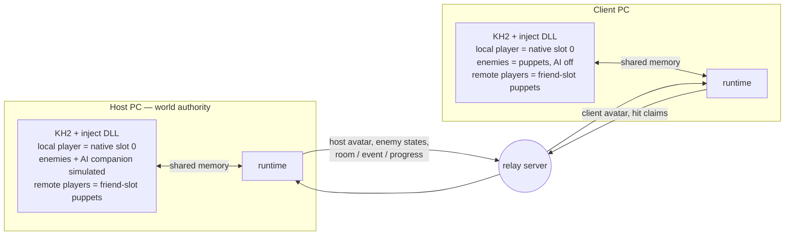
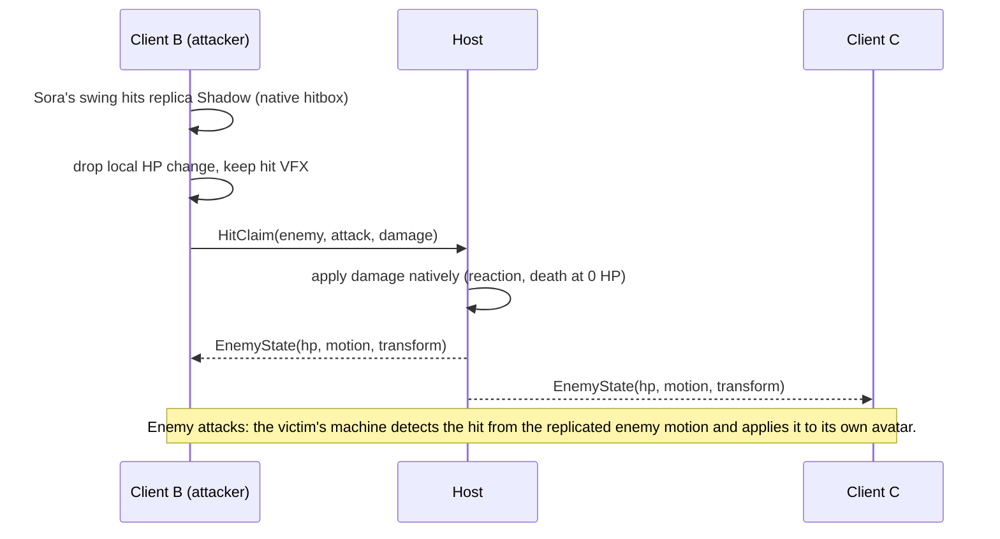

# Online Co-op Plan

> **Status:** proposed plan of record, 2026-10-01. Supersedes the Track A
> milestones M4–M8 in `IMPLEMENTATION_BACKLOG.md` and the authority and actor
> model sections of `kh2_three_client_coop_design.md`. Work is tracked in the
> Linear project **KH2 Multiplayer** (vuhlp workspace); this doc holds the
> design, decisions, risks and phase gates.

## Goal

Two or three players, each on their own PC with their own copy of KH2FM (Steam
Global), play together online: same rooms, same enemies, same story beats, each
with their own camera and full controls. Then widen who you can play as: three
recolored Soras first, then Roxas and Riku, party and world characters, and
possibly enemies.

## Where the project stands (updated 2026-10-06)

| Area | State |
|---|---|
| Pointer map | Party transforms/HP, full locations, camera, entity list, objentry IDs, enemy stats and the damage/death path are mapped. Spawn control and enemy AI suppression remain open. |
| In-process hooks | MinHook DLL hooks the per-entity update, friend AI, pre-physics and the motion setter, and reads raw input. |
| Friend control | Donald moves and animates under player control (F5). He cannot attack, jump, guard or cast. |
| Animation control | Any motion can be set and held on a friend actor without the game resetting it (Session 5). |
| Network layer | ENet relay server, codec, version gate; the 3-client fake-simulation test passes. |
| Live networking | Three live instances on loopback exchange avatars and shared enemy HP/deaths. Private Tailscale transport passed with one real game and a Mac synthetic avatar for two minutes, then two real local games through a Mac relay, normally and with delay/loss. Two separate Windows installations and controller playtests remain open. |
| Hit claims | A client's hits on enemies are sent as claims; the host applies each once through the game's own damage routine and broadcasts absolute HP (protocol 10). Ordinary Shadow combat, including client kills, works on loopback. Attack-specific effects and boss finishers are open. |
| Rooms | Host-follow, late join and same-room reload passed 20 loads across five rooms with three instances, matching full locations, ACKs and native puppet targets. Native client exit denial and host walking exits also passed. After checked native snapshots exposed five unmatched client enemies, scoped host activation passed the original strict 20-load route with empty enemy populations and a source-expiry control. Its unchanged native-wave regression then failed with different enemy identities and an alive host refill. Nonempty spawn/lifecycle authority remains open. Evidence is in `SCENARIOS.md` and `ENEMY_PARITY.md`. |
| Shared progress | Masked native SAVE snapshots/deltas apply before client room initialization and hash actual bytes. Native chest opening passed client mirroring, late join and reload with personal bytes preserved. A naturally acquired visited-room bit also passed late join and reload through the impaired Mac relay (`021630`), with all shared ranges matching before client room initialization. A naturally acquired story flag plus program/visited bytes passed late join and reload (`040303`). Connected story delivery and one empty-room native client hold also passed (`094229`); broader event side effects remain open. |
| Dev loop | The desktop-session rig launches, injects, loads the fixture, drives inputs, captures each instance and checks save hashes without James. One live lane owns it; other lanes stay offline. |

**First friend preview (VUH-1494).** Release09 is sealed for the adopted bounded
preview, pending package handoff and private relay-access approval. It includes
Python/Tk, an exact game-EXE allowlist, package-local owned launch/cleanup,
SaveGuard attestation and role-based user text. Five launcher literal changes
and the guide are the only content changes from rehearsed release08; all native
products, CLI, other scripts, dependencies and licenses are byte-identical.
The decompressed ZIP passed private-path and personal-host-name gates.

Rehearsal10 passed on two fresh package folders sharing one Windows game install:
desktop-only startup without `steam_appid.txt`, save attestation, Mac-relay
connection, automatic names/HP, visible Hide/Show, native Parlor-to-Hall follow,
empty-room GUI reconnect preserving Hide, and clean GUI Exit. It did not drive
combat, a chest or a story event through the desktop launcher. Those now have
current-product rig coverage: the unchanged 012155 combat/chest fixture passed
all 100 steps and the unchanged 040303 story fixture passed all 82 steps through
the impaired Mac relay. The latter retained actual latest-host apply before the
client's native load, all 8108 shared bytes and reload/personal invariants.
Earlier older-build passes are not substituted for these new results. HUD02 and
courtyard walk04 use the same inject/runtime/avatarctl and actual Mac relay pins.

This qualifies a short host-led preview with the tested before-kills courtyard
walk, not an automatic recovery gate or separate-PC acceptance. After-kill,
partial-pack and mid-fight reconnect, broader event side effects and populated
cutscene hold remain unsupported. Event hold is OFF; the guide tells the friend
to stand still during the host's cutscene. The packaged local Windows relay was
not exercised and must stay unchecked. The HUD may briefly report status
unavailable during reward/menu transitions. All runs closed their owned
processes/relays with saves, game files and foreign workspace files unchanged.

One launcher startup stopped after Warp initialization and remains an unexplained
FAIL. The later diagnostic succeeded and captured no hang dump. The 44-start
ledger records launcher 15/16 with a 15-second initialization wait, legacy
combat rig 2/2 with a 15-second wait, and rig 26/26 with a 60-second wait. Limits
and rig DLL-to-PID attribution uncertainties stay explicit; no hook margin is
inferred. Prior failed route attempts and the black window-only recording sample
remain recorded. The published update uses reviewed stills labeled as screenshots.
See the [sealed package](../build/rig/vuh1510-friend-package-20261006-01/release09-result.md),
[desktop rehearsal](../build/rig/vuh1494-friend-playtest-20261006-01/rehearsal10/result.md),
[current combat/chest](../build/rig/vuh1494-release08-combat-chest-regression-20261006-01/root-result.md),
[current story](../build/rig/vuh1494-release08-story-regression-20261006-01/root-result.md),
[44-boot ledger](../build/rig/vuh1510-static-crt-startup-diagnosis-20261006-01/static-startup-ledger-44.md)
and [known issues](FRIEND_PLAYTEST_KNOWN_ISSUES.md).

Courtyard qualification passed all 14 steps. The full run passed late populated
join and progress delivery, then failed its reload comparison: a previously
damaged enemy was 18/20 before reload and 20/20 on both peers in the new native
lifetime. Reconnect was not reached. The original FAIL is retained while the
adopted fixture freezes the Host's HP once per native lifetime, retaining exact HP
through late join and reconnect within that lifetime. Both later qualifications
passed. The trace-enabled full04 then failed at populated join: 25 client
publications remained empty despite activation-lease application. Epochs agreed;
the mismatch value 2 is the DesyncEnemies bit. Hook logging is a possible timing
confound, not a proven cause. The previously unused trace-off full03 passed
populated join and the new-lifetime reload, then failed after a real all-alive
timeout/rejoin: roster, room ACK and progress recovered, but the Client pack was
empty while the Host retained five enemies. Automatic populated reconnect remains
unpassed. Keep the full04 populated-join failure as an intermittent known issue;
the empty-pack symptom is now also recorded with hit logging off. See the
[reload triage](../build/rig/vuh1495-courtyard-full02-triage-20261006-01/result.md)
and [empty-pack triage](../build/rig/vuh1495-courtyard-full04-triage-20261006-01/result.md),
plus the [trace-off reconnect failure](../build/rig/vuh1495-courtyard-static-crt-root-live-20261006-03/live-full-root03/root-result.md).
The unchanged-products activation diagnostic also failed populated join. Its
Client controller stayed empty while the real leased Host point was outside all
seven captured trigger boxes. This supports the current-point explanation but
does not establish the unknown historical emission point. Ordinary manifests
carry first-observed actor positions and observation-order indexes, not native
record identity, so they cannot safely authorize geometry activation. The
candidate uses an explicit protocol 11 observation request and the existing
record-content representation in a separate read-only lifecycle. Reusing the
old resync request would enter Bootstrap, increment delivery and quarantine;
an externally selected profile would leave the same bytes with two meanings.
The new path must preserve normal recovery, never reset or mutate world state
while collecting content, bind fresh complete living records to current scope
and manifest/HP values, and remain default off until source review and fresh
controls. All protocol 10 evidence stays scoped to its original products.
Four unchanged-product checks retained the original empty-join FAIL, then restored
the exact five living Shadows after one bounded Host walk onto the nearby steps.
The second run passed strict reload but stopped before the reconnect checkpoint
because no Mac ACK was observed after timeout retirement. Read-only triage found
the new ACK immediately after the stale fetched prefix; the original FAIL stays.
The third check fetched that ACK within the original 45-second deadline and passed
transport, native re-entry and progress. Its reconnect checkpoint again found an
empty Client, then the walk diagnostic refused before movement because current
activation or cache state was present. Reconnect restoration was then untested;
read-only triage established marker1 with all caches empty. Native dispatch still
reaches the emitter at marker1. The adopted reconnect-only fresh-lifetime fixture
correction kept caches and all parity assertions exact. Walk04 then passed all41
diagnostic steps: each original join/reconnect checkpoint failed empty, then one
900ms Host walk restored the exact five living enemies with fresh hashes/native
rounds and no extras or deaths. This is four join restorations and one all-alive
reconnect restoration, not a passing automatic gate. The known-issues instruction
is limited to that complete living courtyard pack. The source-reviewed protocol11
candidate has built and passed39 codec plus66 loopback controls; its native paths
remain unexecuted and marker0 join-only. It is absent from the package. Its
adopted R1 uses the original five-second request deadline without renewal and logs
sampled-prefix expiry outcomes. Fresh live controls remain required before enable.
See the [activation diagnosis](../build/rig/vuh1495-courtyard-activation-diag01-triage-20261006-01/result.md)
and [source feasibility](../build/rig/vuh1495-geometry-bootstrap-candidate-20261006-01/checkpoint-feasibility.md),
[join restoration](../build/rig/vuh1495-host-walk-bootstrap-probe-20261006-01/root-result.md),
[reconnect probe](../build/rig/vuh1495-host-walk-bootstrap-probe-20261006-02/root-result.md),
[ACK-corrected reconnect refusal](../build/rig/vuh1495-host-walk-bootstrap-probe-20261006-03/root-result.md)
and [marker1 walk restoration](../build/rig/vuh1495-host-walk-bootstrap-probe-20261006-04/root-result.md),
plus the [protocol11 build](../build/rig/vuh1495-geometry-bootstrap-candidate-20261006-01/protocol11/r1/windows-build-02/result.md)
and [source review](../build/rig/vuh1495-geometry-bootstrap-candidate-20261006-01/protocol11/advisor-review.md).
HUD names and reset passed all 32 steps and eight inspected native images,
including natural runtime exit and cleared text. The earlier 020047 FAIL remains
recorded; see the [accepted names/reset run](../build/rig/vuh1507-hud-names-static-crt-prep-20261006-02/live-root01/root-result.md).
These runs used two games on one Windows PC through the private Mac relay, with
unchanged saves and clean owned-process closure. Friend relay access still needs
James's decision before any external playtest.

**Earlier reconnect recovery prototype (VUH-1508).** If a client rejoins while the
host stands away from the enemy spawn area, the client's room comes back without
its enemies: the native spawn trigger never fires for it. This reproduces on
demand (control `20261004-143318`, 5/0/5). A forced resync now replays the host's
recorded activation input through the client's own spawner, so the game respawns
all five Shadows natively, reconciles HP and keeps them (`20261004-143903`, 5/5/5).
It's default-off and covers one all-alive pack only.

The current matched v3 products do not enable that prototype's first-emission
recorder. Full03's empty pack and full04's populated-join failure share the fresh
native-bootstrap/activation path. Current activation leases feed the Host's
current position, which can differ from the traversal that emitted its pack.
That is a hypothesis awaiting a read-only controller census and historical log
comparison, not a demonstrated cause or an adopted product fix. The offline
[emission-point sketch](../build/rig/vuh1495-emission-point-fix-sketch-20261006-01/result.md)
requires a separately reviewed grant, lifetime/death safeguards and fresh control;
it cannot silently substitute an old point into protocol10's freshness contract.

One automatic cycle passed (`20261004-213052`): a fresh complete empty client
census triggered exactly one request and one Bootstrap load, hits stayed held
until the original five enemies matched HP17, and the pack survived 120 live
updates. All four protected saves were unchanged. The first attempt caught a
false setup-time trigger; protocol 10 now requires distinct fresh observations
and a complete empty enemy census instead of a generic hash difference
(`8f905f7`). The product failure `210134` and evidence-helper failure `212553`
remain FAIL. See the [automatic result](../build/rig/reconnect-lead-20261005/automatic-result.md).
James's approved v2 ten-cycle gates (VUH-1508 comment `7ca6ae56`) are parked.

Details, limits and evidence: [FORCED_RESYNC.md](FORCED_RESYNC.md), `SCENARIOS.md`
and the VUH-1508 thread. The added-emitter/B1/loader-installer route is parked;
its history is in FORCED_RESYNC.md.

Private transport now works without a friend: the relay can run on the Mac,
and the rig can script multiple real Windows games on this PC. A headless
client can also supply avatar traffic. This permits automated network checks;
the first human friend session and a second Windows installation remain open.
Combined impaired Mac-relay sessions passed with overlays OFF (`001439`) and
ON (`012155`). In the latter, five client claims each joined one host receipt
and native application, enemy HP matched, the target died once per game, and
native chest opening persisted through client reloads. Both screens showed
RTT/loss. No game crashed and all four protected saves were unchanged. The
reviewed render fix uses fresh external DIRECT submissions on the Present
thread, freezes the GPU queue/swapchain and fence timeline, and stops GPU work on failed calls.
The old dump proved the previous retained queue differed from the swapchain's
queue. The new run directly matched all three presentation queue slots on
both games before and after gameplay. This is bounded acceptance, with startup
capture failures still retained; earlier overlay-ON `000836` remains CRASH.
See the [overlay-ON result](../build/rig/vuh1493-combat-progress-mac-relay-20261005-01/combined6-result.md)
and [independent review](../build/rig/vuh1493-combat-progress-mac-relay-20261005-01/combined6-acceptance-review.md).

The private development join guide also passed (`020845`), with bidirectional
native movement and both RTT/loss overlays. Its preceding startup capture
failures exposed the game's Present-thread handoff; injected CPU work is now
serialized across callers while the GPU queue stays fixed. The passing guide
did not expose a handoff after binding. A separate private native control then
reproduced the old thread rejection while the candidate completed both captures
after the first thread exited, with a healthy GPU and changed overlay pixels.
See the [native handoff result](../build/rig/overlay-gpu-probe-20261005-01/thread-handoff-full-20261005-01/root02-result.md)
and [independent review](../build/rig/overlay-gpu-probe-20261005-01/thread-handoff-full-20261005-01/handoff-regression-review.md),
and [guide result and limits](../build/rig/vuh1493-join-guide-dry-run-20261005-01/guide3-result.md).

Native visited progress passed over the impaired Mac relay (`021630`): the
host acquired BC05/05's visited bit through native loading, and a client that
never entered that room received it in GoA before its join load and retained
it through reload. All shared ranges and personal apply invariants matched,
and protected saves stayed unchanged. This covers visited/full-state bootstrap.
See the [result](../build/rig/vuh1497-native-progress-mac-relay-20261005-01/visited1-result.md)
and [independent review](../build/rig/vuh1497-native-progress-mac-relay-20261005-01/visited1-acceptance-review.md).

Native story acquisition also passed (`040303`, independently accepted): the
host completed the game's 08/0C event, acquired a story flag and program/visited
bytes, then returned to GoA. A client that never loaded the event room applied
the latest full snapshot before its join load and retained the story flag through
reload. Native movement returned in the actual completed event tuple. Personal
bytes and protected saves were unchanged. This proves acquired story state for
late join/reload. The connected hold result below extends event delivery; skip
and arbitrary story side effects remain open. See the [result](../build/rig/vuh1497-native-progress-mac-relay-20261005-01/story2-result.md)
and [independent review](../build/rig/vuh1497-native-progress-mac-relay-20261005-01/story2-acceptance-review.md).

Five room-specific initial joins and same-room reloads also passed through the
impaired Mac relay: GoA plus BC01/04/05/06. Full native tuples, latest progress
application before client loading, raw shared bytes and fresh native hashes
matched. These cases have matching empty enemy populations; populated joins,
later waves and dead-pack recovery remain open. See the [five-room result](../build/rig/vuh1497-native-progress-mac-relay-20261005-01/five-room-result.md)
and [independent review](../build/rig/vuh1497-native-progress-mac-relay-20261005-01/five-room-acceptance-review.md).

A populated-room join fixture is now accepted offline: one late initial join
into the admitted four-enemy 18/11 pack and one explicit same-room reload. It
requires original host bindings through join, a qualified rebuilt lifetime on
reload, strict per-peer read-time/publication floors and four distinct native
records. All 67 controls and 14 independent focused rechecks pass; the first
review's replay/record-alias failures are retained. No product change or live
run occurred. Populated join/reload behavior remains open. See the [fixture](../build/rig/vuh1495-populated-join-prep-20261006-01/result.md)
and [accepted recheck](../build/rig/vuh1495-populated-join-review-20261006-01/recheck-01/result.md).

The fixture's single live attempt `233433` failed at host admission before the
late client started. Two fresh host hashes contained four object-309/HP160 rows;
the unchanged required two309/two311 shape refused them. No independent census,
late join or reload ran. The host-first population recipe is unqualified, with
no cause assigned and no retry or relaxed predicate. All 127 pins, four saves
and 16 foreign files stayed unchanged; three owned PC processes and the owned
Mac relay/supervisor are absent. See the [closed attempt](../build/rig/vuh1495-populated-join-prep-20261006-01/live-root01/result.md)
and [independent result review](../build/rig/vuh1495-populated-join-review-20261006-01/live-review-01/result.md).

The overlay now shows the actual network player slots and owner HP. The bounded
HUD run `073856` passed through the impaired Mac relay: both games showed their
correct Host/You labels and two 24/24 bars, independently distinguished from the
native Donald actor's 18/18 HP. After the remote runtime left, its row became an
open slot with no health bar and stayed that way. Root inspected all six captures;
movement still propagated and all four protected files stayed unchanged. The
owner publishes copied telemetry through a nonblocking mailbox; Present consumes
no native game pointers for these rows. Normal and ASan CPU checks cover mapping,
retirement, contention and concurrent copies. Names, MP, downed/revive, reconnect
and full HUD acceptance remain open. See the [HUD result](../build/rig/vuh1507-hud-prep-20261005-01/hud-root01/result.md)
and [source review](../build/rig/vuh1507-hud-prep-20261005-01/independent-review.md).

The bounded names/MP source check found that admitted owner peer IDs can supply
labels, but distinct display names need additional roster transport. Protocol 10
already carries MP fields; native capture currently leaves them at placeholder
0/0. Numeric MP needs calibrated owner and native-friend mappings before HUD
acceptance. See the [next HUD slice](../build/rig/vuh1507-hud-prep-20261005-01/names-mp-next-20261006/result.md).

The reviewed HUD name implementation now uses admitted user-chosen peer IDs
under protocol 10. Labels are tied to the current owner connections and session
generation, expire after 1,000 ms, and clear on retirement. Invalid labels leave
owner HP intact. This first increment accepts trimmed printable ASCII and shows
at most 23 characters; separate display names and Unicode remain outside its
scope. AvatarBridge is now v3, so DLL, runtime and avatarctl must match. The
exact reviewed patch linked all three Release products privately, and 62 name
controls passed normally and with Windows ASan; the existing 52 HUD controls
also passed with ASan. Accepted older products and `073856` remain unchanged.
The matched private v3 products were tested in `020047`, which remains FAIL.
Root inspected seven actual captures: both games showed the correct admitted
names, Host/You labels and owner HP before and after movement; departure showed
Waiting then Open, and stopped-runtime expiry showed Name unavailable while
retaining HP. The reset capture is absent. The owned host did not provide a
qualified natural exit0 within the unchanged 150-second reset deadline; its
actual final poll value was not retained. A bounded source audit establishes
that 7,500 runtime iterations at tick16 do not promise a 120-second wall-clock
exit, but leaves the failure mechanism unproved. Reset, the eight-image gate,
MP and full HUD acceptance remain open. All saves were unchanged and owned
resources closed. See the [live FAIL](../build/rig/vuh1507-hud-names-launch-prep-20261006-01/live-root01/result.md),
[shutdown audit](../build/rig/vuh1507-hud-names-shutdown-audit-20261006-01/result.md),
[source review](../build/rig/vuh1507-hud-names-review-20261006-01/result.md)
and [matched build](../build/rig/vuh1507-hud-names-prep-20261006-01/integration-build/result.md).

The strict impaired Mac-relay two-pack wave gate remains unpassed. Corrected
attempt `211819` passed its effective input witness and neutral release but
failed the position-closing guard before any kill. Original first-pack IDs
3/4/5/6 matched HP 153 on all three games and the independent native checkpoint;
later waves remain unexposed. One input interpretation, one fixture correction
and one live attempt are complete, with no retry. James selected assessment of
the reviewed one-shot fixture position restore, retaining the original failures.
Its no-kill control `215309` failed: all three scalar responses/readbacks passed,
but X changed between writes, and the final full-XYZ read crossed a native frame.
The required post-restore region/enemy control was not reached. No retry or full
run followed; saves, sources and pinned inputs remain unchanged and owned
processes are closed. The scalar restore assessment is complete but unqualified.
A different write method needs independent review and a passing control before
full waves. See the [restore control](../build/rig/vuh1502-native-waves-mac-relay-20261005-01/position-restore-control-root01/result.md)
and [prior run/options](../build/rig/vuh1502-native-waves-mac-relay-20261005-01/effective-input-region-approach-root01/result.md).

The reviewed single-call 12-byte XYZ write passed its one no-kill control
`004941`: exact readback, natural native bit8, and original four enemies at
HP153 on all three games in fresh hashes and independent native rounds. This
does not prove atomicity or lasting position. The unchanged full gate `010014`
then failed at step 45 after two issued kills, IDs3/4, before the call for ID5.
Its last host native census retained only original5/6 living at HP153 and3/4
dead at HP0. The failing fresh canonical living-set reply was not saved, so
the cause is unproved. First-wave final death parity, second-wave IDs/HP/deaths
and final quiet checks remain open. Both runs used Mac50/10/2; all saves stayed
unchanged and owned processes/relay closed. See the [passing control](../build/rig/vuh1502-native-waves-mac-relay-20261005-01/xyz-single-call-control-root01/result.md)
and [full FAIL](../build/rig/vuh1502-native-waves-mac-relay-20261005-01/xyz-single-call-full-root01/result.md).

Technical test choices belong to the lead; the advisor reviews non-obvious
tradeoffs or check changes. The bounded audit of010014 found no deterministic
harness defect, and the missing reply leaves its cause unproved. The resulting
logging-only candidate retained every predicate and required a fresh control
for its changed execution signature. A failed single control ends that approach
without restore tweaks. Push/release, machine/system changes, account/network
exposure and writing James's saves still require James. All prior failures
remain FAIL.

The logging candidate's fresh control `012309` failed at step 45: its successful
single 12-byte request was followed by a qualified same-frame readback of
555.928955/-1100/-2353.774170 instead of 555/-1100/-2356. No kill, retry or
later region/enemy control ran. Its one control is consumed; no dependent full
run follows, and 004941 cannot qualify the changed signature. Exact equality
is retained, with no tolerance or restore tweak. The reviewed next method is
one host-only observation of two or three other prespecified populated rooms,
each declared activation followed by 15 seconds neutral sampling. Stable host
membership is only fixture evidence; actual two-wave and join parity still
need their full gates. Saves stayed unchanged and owned resources closed. See
the [closed control FAIL](../build/rig/vuh1502-native-waves-mac-relay-20261005-01/xyz-canonical-logging-control-root01/result.md).

The first passive collection `015317` failed in BC05/04. Its exact installed
five-enemy first pack qualified in five independent samples through 12 seconds:
four object302 at HP20 and one object303 at HP98, with unchanged IDs, bindings
and full record bytes. The terminal 15-second sample was unsafe after the native
log recorded Sora taking 24 damage, HP24 to0. No protection, writer, kill or
rescue was issued; global abort left courtyard05/06 unattempted. This is neither
a stable-window PASS nor a populated event result. The advisor agreed one fresh
BB04 no-kill control using the unchanged accepted wave protection baseline,
then a five-then-three full gate only if it passes. Fresh native bit8 remains
required; region exits must be retained without correction. All saves and
owned-resource closure passed. See the [passive FAIL](../build/rig/populated-room-stability-launch-prep-20261006-01/live-root01/result.md).

That protected control `021001` also remains FAIL. All six samples retained the
exact five enemies and HP. At 15 seconds Sora was alive at HP24 and team0, but
fresh header25 bit8 was false after outward displacement. The sequential
entities and raw position replies differ; they are not one atomic pose. The
bounded audit cannot attribute the movement to input, contact or a hit. Its one
control is consumed, with no full run or retry. Source review shows no bit8
precondition in the selected diagnostic damage/kill entry, while ordinary
region admission gates emission separately from cooldown and stage conditions.
The advisor clarified that no loosening binds the acceptance assertions and
approved a new fixture locating fresh native bit8 at emission points. Every
all-peer HP/ID, death, second-pack, no-extra and quiet assertion remains. The
new method needs one fresh control; old failures are not reclassified. A quick
native entrance lookup found no deeper supported placement preserving this
pack. See the [protected FAIL](../build/rig/vuh1502-bb04-control-prep-20261006-01/live-root01/result.md),
[audit](../build/rig/vuh1502-bb04-displacement-review-20261006-01/result.md)
and [entrance consumer lookup](../build/rig/vuh1502-bb04-entry-consumer-lookup-20261006-01/result.md).

Fresh emission-scoped control `023926` passed: all six samples retained the
original five enemies and HP, with bit8 required at admission and the later
false value retained. Full `025347` remains FAIL before the third damage call.
The first two host applications were98->91 and20->13; the exact whole-phase
checkpoint, deaths and second pack were not reached. Actual entry weights
were8/15, unchanged. Its two-round reader refused one raw flags9B8 change,
`0x4C83 -> 0x483` (xor`0x4800`), while the other returned fields agreed.
This does not establish the flag cause or final all-peer damage convergence.
Independent review accepted the closed FAIL; saves, execution pins and owned
PC/Mac closure passed. The advisor approved a new fixture comparison using
source-backed native eligibility bits, retaining raw words and every acceptance
assertion, followed by one fresh control and one full only after PASS. Old
FAILs remain. See the [control PASS](../build/rig/vuh1502-bb04-emission-control-prep-20261006-01/live-root01/result.md),
[full FAIL](../build/rig/vuh1502-bb04-emission-wave-launch-prep-20261006-01/live-root01/result.md)
and [independent review](../build/rig/vuh1502-bb04-emission-full-review-20261006-01/result.md).

Fresh semantic-mask control `030712` passed. Full `030933` remains FAIL,
although all five first-wave enemies reached exact all-peer damage HP and
exactly-once deaths on both clients. It stopped at step47 before proving an
empty gap: consecutive native reads shared the coarse `time.monotonic()`
value, and the strict ordering guard refused. The second pack was unobserved;
the initialized step status does not prove completion. Closed independent
review adopted that scope. The advisor approved a new fixture that brackets
each actual native read with `perf_counter_ns()` and requires strictly ordered,
non-overlapping reads, retaining the coarse fields and every acceptance check.
One fresh control precedes one full run. No pauses or budgets were added.
See the [control PASS](../build/rig/vuh1502-bb04-eligibility-control-prep-20261006-01/live-root01/result.md),
[full FAIL](../build/rig/vuh1502-bb04-eligibility-wave-launch-prep-20261006-01/live-root01/result.md)
and [independent review](../build/rig/vuh1502-bb04-eligibility-full-review-20261006-01/result.md).

The fresh QPC no-kill control `032130` passed and its closed evidence was
requalified by the actual full launcher. Full `032656` remains FAIL at initial
count convergence, before strict admission or any hit: the saved counts were
empty in all three games, and retained host publications stayed empty. All
three peers were verified. The final sampled host point was about20 units
short of the retained activation cylinder; why movement differed is unproved.
No QPC emission read or wave acceptance was exercised. Execution pins, four saves,
six owned PC closures and the closed Mac relay receipts passed. No retry.
See the [fresh control](../build/rig/vuh1502-bb04-qpc-control-prep-20261006-01/live-root01/result.md)
and [full FAIL](../build/rig/vuh1502-bb04-qpc-wave-launch-prep-20261006-01/live-root01/result.md).
The [independent review](../build/rig/vuh1502-bb04-qpc-full-review-20261006-01/result.md)
adopted that scope. The advisor approved a new fixed fourth900ms activation
round with position logging after every round, a fresh control and one full
after PASS. A further activation miss calls for a capped native-activation
stop, not another fixed round. All original acceptance checks remain.

Fresh four-round control `034300` passed with four actual XYZ logs and the
same five enemies/HP in all six samples. Full `034523` activated the pack and
passed exact all-peer damage HP91/13/13/13/13. It remains FAIL after lethal
calls for IDs1/2, before the third call: one client native census changed during
its read, so the reader refused complete absence evidence. All four round-end
positions are retained for all three games. Whole first-wave death, empty gap,
second pack and final quiet acceptance remain unproved. All197 execution pins,
four saves and16 foreign files are unchanged; six owned PC processes and the
Mac relay are closed. No retry. See the
[control](../build/rig/vuh1502-bb04-activation4-control-prep-20261006-01/live-root01/result.md)
and [full FAIL](../build/rig/vuh1502-bb04-activation4-wave-launch-prep-20261006-01/live-root01/result.md).
The [independent review](../build/rig/vuh1502-bb04-activation4-full-review-20261006-01/result.md)
adopted this scope: both issued deaths applied once per client. The sole
changing field was nextHandle on an original client actor already issued
lethal. Its mutation cause and successor identity remain unproved. The advisor
approved a new narrow adapter that retains such incomplete reads and polls a
fresh whole census within the original20s/48-round bounds, before any new hit.
Only that field on an already-issued-death actor is eligible; every other
changing field or failed guard still refuses. Discard counts must be reported
per phase. Complete native acceptance remains mandatory, with a fresh control
and one full only after PASS. No hit is reissued and no deadline is renewed.

Fresh linkpoll control `040051` passed and the full consumer requalified its
closed evidence. Full `040547` passed original all-peer admission and exact
damage HP91/13/13/13/13, then issued three lethal calls for IDs1/2/3. Each
reached hostHP0 and applied once on each client. It remains FAIL before the
fourth call: complete census03 and its canonical living reply retained two
survivors, but the first weight snapshot found a changed nextHandle on living
netId5/record55. Core identity pointers matched. This comparison was against
the fresh census, not admission; mutation cause and successor are unproved.
Census discards were zero in both reached phases, so the narrow classifier
was not exercised live. Whole-wave deaths, empty gap, second pack and final
quiet acceptance remain unproved. Saves, foreign files and owned PC/Mac closure
passed; no unchanged retry. See the
[control](../build/rig/vuh1502-bb04-linkpoll-control-prep-20261006-01/live-root01/result.md),
[full FAIL](../build/rig/vuh1502-bb04-linkpoll-wave-launch-prep-20261006-01/live-root01/result.md)
and [independent review](../build/rig/vuh1502-bb04-linkpoll-full-review-20261006-01/result.md).

The advisor approved a new fixture that retains raw nextHandle but excludes
it from identity equality between the census and weight read, and between
two independent weight snapshots. Core pointers, native weights, eligibility,
HP, list bounds and all remaining guards stay. Within-walk list consistency
and its existing narrowly bounded whole-census re-read remain mandatory.
One fresh matching control precedes one full only after PASS. All acceptance
assertions and recorded FAILs remain unchanged.

Fresh control `042344` and full `042645` now PASS the declared BB04
five-then-three gate through the private Mac relay. All77 steps completed on
three real KH2 instances on the Windows PC, with50ms delay,10ms jitter and2%
configured loss confirmed in each runtime log. Original IDs1-5 matched on all
three games at HP98/20/20/20/20, then91/13/13/13/13. Second-wave IDs6-8 matched
at HP98 each, then91 each, with original native bindings and no extras.
All eight lethal calls reached hostHP0 and applied exactly once per client.
The living-empty gap was observed before actual second-pack admission. After
the6.031s no-refill window, two fresh all-peer empty hashes and two complete
native censuses had zero living and zero native enemy rows. Final weight,
source-backed eligibility, fresh bit8 and QPC emission checks passed.

Independent review ADOPT and179 reviewed hashes matched. Four-phase census
discards were zero; the narrow re-read branch remains unexercised. Raw links
changed between separate censuses, but neither omitted comparison encountered
a mismatch here. Full198 execution pins/91 historical sources matched, saves
and16 foreign files remained unchanged, and all owned PC/Mac resources closed
with25 fetched hashes matching. Every earlier FAIL stays. See the
[accepted result](../build/rig/vuh1502-bb04-linkidentity-wave-launch-prep-20261006-01/live-root01/result.md),
[fresh control](../build/rig/vuh1502-bb04-linkidentity-control-prep-20261006-01/live-root01/result.md)
and [independent review](../build/rig/vuh1502-bb04-linkidentity-full-review-20261006-01/result.md).
This qualifies the automated same-PC rig gate. Separate-PC friend play and
reconnect remain outside this evidence; retained relay divergence captures
also prevent an uninterrupted-equality or desync-free claim.

Populated joins have a separately declared variant: capture the exact living
host pack after fresh hashes and independent native qualification, then require
the late client to match its count, original IDs, types and HP exactly. The
existing record, freshness, progress, lifecycle, no-extra and no-death checks
remain. This variant gets one live attempt; it does not reclassify `233433`.

That attempt `005739` failed before freezing the reference or starting the
late-client runtime: two fresh hashes and native round0 had four309/HP160,
then native round1 had six, adding two311/HP160. Native and publication agreed
within each round; the pack changed between admission observations. No join or
reload parity was exercised. Independent review adopted that refusal. Its one
attempt is consumed, with saves unchanged and owned resources closed. A new
settle-only variant is being prepared: one evidence-sized fixed wait before
the same exact qualification and immutable freeze, no recapture or retry. See
the [closed FAIL](../build/rig/vuh1495-host-qualified-join-prep-20261006-01/live-root01/result.md)
and [independent review](../build/rig/vuh1495-host-qualified-join-review-20261006-01/result.md).

The new settle-only attempt `012035` also failed before admission. Its fixed
7144ms wait was sized from twice the largest retained sampling envelope,
then the unchanged death-history guard refused original IDs 1/2 leaving the
list at last HP160 and being reported as despawned. This is not native HP-zero
kill proof; no reference froze, late runtime started or join/reload ran. The
one settle attempt is consumed, without another 18/11 timing variant. Saves
and owned-resource closure passed. Independent result review adopted the
FAIL. See the [settle result](../build/rig/vuh1495-host-qualified-join-settle-prep-20261006-01/live-root01/result.md).

One connected native cutscene hold now passed through the impaired Mac relay
(`094229`, two real games, normal process priorities). The client opened its
own Pause menu, suppressed a tested movement command while the host completed
08/0C evt1, then closed within 406 ms and stayed latched until actual arrival,
complete empty enemy census and all 8,108 shared progress bytes matched. Fresh
movement worked after release. Personal bytes and all four protected files
stayed unchanged. The feature defaults off and covers one already-bound
empty-room client/event; populated rooms, repeated events, skip and reconnect
during a hold remain open. See the [hold result](../build/rig/vuh1498-cutscene-prep-20261005-01/client-hold-result.md)
and [independent review](../build/rig/vuh1498-cutscene-prep-20261005-01/native-client-candidate/acceptance-root15/review.md).

Populated hold prep is accepted offline, with 29 controls and a strict ordinary
populated-admission checkpoint. Its 59-step scaffold refuses before boot and
preserves all 55 accepted hold steps. A live populated hold needs three concrete
prerequisites: reviewed populated event eligibility/convergence (current ACKs
require both enemy lists empty), a qualified pause/event membership reader
(current census requires ordinary gameplay), and an observed natural event
recipe with an explicit enemy-lifetime outcome. No product change or populated
hold run occurred; `094229` remains empty-room evidence. See the [prep and prerequisites](../build/rig/vuh1498-populated-hold-prep-20261006-01/result.md)
and [offline adoption](../build/rig/vuh1498-populated-hold-review-20261006-01/result.json).

See [private joining and simulation](JOIN_GUIDE.md). General cutscene support,
waves and bosses, and the package also remain open.

## Prior art (researched 2026-10-01)

- **KH2 Online Coop** ([Expert595/kh2-multiplayer](https://github.com/Expert595/kh2-multiplayer),
  Sept 2026) is the closest match. Every player stays Sora locally; remote
  players are projected into the friend slots (transform written each tick,
  velocity zeroed, follow timer pinned, the vanilla motion reset blocked — the
  same techniques as this repo's Session 5 work). A native Sora is spawned in
  a companion slot by writing the playable-character selector into the world
  party table (save `+0x3534`) before a room load. It runs two local instances
  ("if Steam/Epic blocks the second launch, start the second KH2 process
  manually"). Scope by its own account: movement and independent rooms, not
  combat. External Python client, TCP/JSON relay, no license stated. It
  validates D3 and lowers R1/R2; its README also warns never to save while the
  replica slot is active.
- **OOT True Coop** (Ship of Harkinian fork, July 2026) is the closest match to
  the enemy plan, though built on decompiled source: a deterministic enemy key
  (room, spawn-order index, actor id, params), AI suppressed on clients with
  colliders kept, hit requests run through the enemy's own damage code, deaths
  delivered as synthetic lethal hits, local AI takes over if the host stream
  stops.
- **Archipelago KH2** is the most mature networked KH2 memory client: it
  re-asserts expected state every loop, gates writes on fade/load state (magic
  granted in a load zone crashes), moved death detection into a per-frame
  companion because polling missed deaths, and keeps per-version address
  tables. LuaBackend's Hook fork exists because scripts running outside the game
  loop caused crashes and wrong warps.
- **Shared enemies are where comparable projects stall.** ModLoader64's OoT
  Online never shipped them, HKMP took about 3.4 years, sm64coopdx is still
  fixing them object by object, and Skyrim Together's ownership bug lived four
  years. Nobody has synchronized blocking story cutscenes; projects make them
  local or drop the story.

Sources, the other projects surveyed (MTA:SA, SA:MP, BotW Multiplayer,
Seamless Co-op, Sekiro Online, SMO Online, Ship of Harkinian Anchor, Teamruns,
HKMP) and a pitfall list: `docs/research/PRIOR_ART.md`.

## Decisions

Format: decision — why (rejected alternative).

- **D1. Each player runs their own game; no lockstep.** KH2 has hidden timers,
  RNG and scripted state we can't make identical across machines (lockstep,
  rollback).
- **D2. Owner-authoritative avatars, host-authoritative world.** Each machine
  simulates its own player character natively and streams its state. The host
  machine simulates enemies, AI companions, rooms, events and story flags. We
  can't rewind or re-simulate KH2, so routing a player's input through the host
  would leave their own character a round trip behind their stick (host
  simulates all three players from forwarded input — the original design).
  Cheating isn't a concern among friends.
- **D3. Local-primary actor model** *(confirmed by James 2026-10-02 after VUH-1489)*. On every
  machine the local human is the native player (slot 0) with all of Sora's
  systems — combos, magic, items, lock-on, camera, HUD — and no control RE.
  Remote humans appear as puppets in the friend slots, so three recolored Soras
  is the default roster. (Canonical slots — Sora on every machine, players 2
  and 3 as Donald and Goofy through friend AI replacement — need per-move friend action
  injection *and* a player-class puppet on every client, and make three Soras
  the hardest roster instead of the easiest.) The existing friend
  AI-replacement work becomes the puppet driver and, later, the route to
  playing party members and enemies.
  **Flexible parties (James):** each party slot can be a remote player,
  Donald, Goofy, the world ally or empty, set per session through the world
  party table (VUH-1519). That covers everyone in one party, players replacing
  NPCs, no NPCs, and solo play. Keeping your own NPC party while joining
  someone else's world needs more actors than KH2 has slots; that's a stretch
  goal.
- **D4. Hits are detected where they are seen; enemy HP lives on the host.** The
  attacker's machine detects its hits on replica enemies and sends a claim; the
  host applies the damage and decides deaths. The victim's machine detects
  incoming hits from replicated enemy attacks and applies them to its own
  avatar. Host-side detection of enemy→player hits is the fallback if
  replicated enemy motions don't produce hitboxes. The host always broadcasts
  absolute HP, never deltas (Skyrim Together's delta drift). (Host-side
  detection for everything — "I hit it and nothing happened" at every latency.)
  The initial automatic path accepts ordinary HP damage only: direct native
  ownership must resolve to the canonical local player; healing types, applied
  records, NPCs and remote clones cannot publish. Protocol v3 binds claims to
  the relay's current connection ID, monotonically increasing sequence,
  announced epoch, netId and objectId. Rejoining gets a new connection ID;
  runtime roster changes retire queued claims before native application.
  The host consumes a sequence before one native attempt and recaptures the
  checked census afterward. This invokes TakeDamage with a negative HP delta;
  it does not replay attack parameters or establish boss finisher/survival
  semantics. Current checked metadata reduces stale-pointer risk without
  proving native creation identity; D5 retains that unresolved boundary.
  Native courtyard acceptance now covers 22 uniquely applied client claims,
  including three ordinary Shadow kills delivered once to both clients, with
  matching applied HP/population/progress hashes. This is bounded D4 evidence;
  victim-side enemy attacks, boss finishers and general wave parity remain open.
  See [native claim acceptance](SCENARIOS.md#automatic-client-hits-native-courtyard-acceptance-2026-10-02).
  A default-off passive hit observer is now verified offline, joining current
  session and canonical victim facts to genuine nested adjusted damage and
  checked HP. The observer itself changes no damage policy. A separate active
  HP ownership gate is now implemented and verified offline: supported remote
  victims/sources and unknown sources are suppressed; host enemy damage needs
  a canonical host avatar or positively observed native companion; ordinary
  canonical client attacks retain the single claim-before-zero path. The native
  call and hit consumption remain intact. Fresh-client incoming-hit validation,
  native puppet-veto acceptance and step-2 replicated hitboxes remain open;
  see [incoming acceptance](SCENARIOS.md#incoming-player-damage-remaining-acceptance).
  The opt-in hit trace now also records the actual ownership decision, three
  roster IDs, claim result, revalidation and checked-zero outcome in its bounded
  scope. A separate offline audit can verify checked noncanonical type-0 zero
  scopes without treating them as incoming-damage witnesses or authenticated
  remote membership. Native callback and gameplay acceptance remain unverified.
- **D5. Enemies spawn natively everywhere, are matched by a deterministic key,
  and are shared in two steps.** The key is room + `btl` program + spawn-entry
  index + objectId, type-checked on every message. Step 1 shares only HP and
  deaths: every machine keeps its own enemy AI, attackers claim hits, and the
  host's deaths reach clients as synthetic lethal hits through the enemy's own
  damage routine, so the native death path (drops, wave counters, barriers,
  boss finishers) runs. Step 2 mirrors the host's enemy AI onto AI-suppressed
  client copies that keep their colliders — the OOT True Coop pattern. Step 1
  is a playable fallback if step 2 stalls, as shared enemies have in every
  comparable project. (Suppressing native spawns and spawning on command needs
  spawn-function RE; it stays the fallback if keys don't match.)
  The current candidate passes first-pack native HP/deaths with complete typed
  censuses, but its latest diagnostic had an empty second wave and controller
  count two. General spawn convergence, multi-wave barriers and boss finishers
  remain open; preserve the earlier strict divergence alongside this bounded pass.
  Offline surviving-population review (2026-10-03) narrows the fallback to a
  fresh, complete snapshot-defined living set, with an exact portable native
  record map and separate current source/target controller incarnations. It
  need not replay historical constructor events. Manifest observation order,
  a bare actor address, count equality or an empty ready-enemy census cannot
  certify native enrollment or exclude pending actors/reinitialization.
  The actual type2 dispatcher runs the full native emitter, but the five fixed
  records each have delay8: one call can emit at most one successful record,
  and AL1 also permits zero/partial creation. A candidate must retain original
  native cooldown progression across bounded ticks; direct dispatch omits
  outer event/disabled gates and accepted-region flag handling. No count/cache,
  flag or geometry patch establishes that missing equivalence. The current
  historical-input policy uses the separately recorded host first-emission input;
  it claims bounded convergence, not original replay equivalence.
  Fifteen recorded nonnull AllocationPassed returns were immediately
  actor-read-unavailable, with thirty later complete-census correlations.
  Unavailable default zeros are not observed native zeros or death, and later
  same-address matches do not prove continuous allocation lifetime. Fresh
  enrollment/pending witnesses, actual eligibility/flag semantics, partial
  outcomes and ordered post-cut death handling remain unproved. This is an
  historical offline candidate assessment, not validation of an implemented recovery operation or a
  general wave/empty-room solution (`SCENARIOS.md`).
  Follow-up saved-data replay establishes all thirty full64-byte native records
  are equal across the six setup peer observations (array SHA447e6d0f...d660df),
  with actual actor/binding joins to IDs11,12,13,14,18. It does not supply raw
  full headers, relocation diversity or the failing load7's definitions.
  Those missing-header/load observations belong to the earlier setup replay.
  The later `20261004-020622` diagnostic captures all 26 ordinary records in
  all 36 samples, including the failing load, with complete combined scope in
  both empty Friend1 observations; global/lifetime/pending proof stays open.
  Saved-PE review resolves the event gate: 3ABC80 is read-only/no-argument;
  nonzero AL blocks and AL0 permits native cooldown/region work. The later run
  records 55 genuine gate AL0 returns and seven BOX AL0 returns per invocation
  within its conditional original-thread bracket. Finalization atomics and fiber
  continuity remain unproved. Independent saved-code/list review confirms those
  BOX AL0 returns bypass the sole ordinary dispatcher call and exhaust the
  seven-node loop; it does not exclude other invocations or creators. Continuing
  to replay that sampled point cannot reconstruct the surviving pack through
  this path. Exact portable record-content comparison and native catalog capture
  are accepted offline for the host-commanded fallback. The new protocol9
  native living Bootstrap qualifies all10 definitions/26 records and corrects
  five native HP20 values to17 on each original friend, with later checked
  HP17 observations. Absent-pack reconstruction remains open and creation
  stays disabled.
  Accepted-region bit3 has NPC and script
  consumers; the verified Shadow handler is distinct. An outside-region living
  intent may truthfully retain bit3clear, but its supported actor/script/lifetime
  semantics must be proved instead of copying an accepted-path flag.
- **D6. One shared save for the MVP.** All players load the same co-op save,
  clients never save, and host progress is canonical. P2 adds runtime mirroring
  of host story state for drop-in play: an idempotent log of host flags,
  applied at room boundaries and re-applied after every load and death, as
  Archipelago does. (Merging different players' saves — out of scope.)
- **D7. The host leads transitions and cutscenes.** Client-initiated exits and
  event triggers are blocked; host room changes are replayed on clients with a
  forced warp; during host cutscenes clients hold behind an overlay, then
  resync. Synchronized cutscene playback is later work.
- **D8. Personal loot and EXP.** Each machine keeps its native drops and EXP;
  they aren't replicated. Story flags and world state are shared; inventories
  and levels are per player.
- **D9. Frame-accurate work lives in the DLL, at one write point, behind a
  state gate.** Avatar capture, puppet writes, damage interception and warps
  run in-process; the runtime process handles networking and orchestration
  through a shared-memory queue. A per-frame detour drains that queue at a fixed
  point in the frame, and a state gate (loading, fade, cutscene, menu, pause,
  controllable) holds writes that would land in a load zone or cutscene. Hooks
  install only after the target bytes match. (Cross-process writes race the game
  loop — why Strategy A puppeting failed, and why LuaBackend needed its Hook
  fork; Archipelago crashed granting magic in load zones.)
- **D10. The relay server stays; the host is whoever owns the world.** The
  existing ENet server is lobby and relay, run on the host PC or a small
  Tailscale/VPS node. No host migration: if the host leaves, the session ends.
  **Hosting is Minecraft-style (James, 2026-10-02):** the host runs the relay
  next to their game and friends join by address; no central service.
  Friends reach the host over Tailscale (first test) or, if the host chooses,
  a forwarded UDP port (VUH-1493).
  **Revised by James, 2026-10-06:** no Tailscale or port forwarding for
  friends. Steam P2P networking (Steam Datagram Relay through the game's own
  Steam session) is the preferred transport, pending the VUH-1493 feasibility
  spike; ENet stays as the fallback and the test-rig transport.
  The relay now removes all old co-op connections on clean host departure or
  heartbeat expiry, clears cached world/progress state and keeps listening for
  fresh joins. Headless loopback teardown/rejoin controls cover this boundary;
  Each accepted Player lifetime now mints an opaque OS-random world incarnation;
  the configured session name is only a label. The v5 client pins that token
  and the original host connection/peer before bounded friend-only rejoin.
  A changed host or restarted relay is terminal. Initial failure and Player
  loss never auto-retry. Separate transport/roster deadlines and five attempts
  within 60 seconds bound recovery; ten uninterrupted seconds of admitted
  membership reset the budget, without claiming native readiness. Current WorldBridge
  v11 retains v8's retirement before a delayed reset and rejects outgoing
  records carrying a retired producer generation. Native gameplay recovery and
  remote reconnect remain open (`SCENARIOS.md`). The relay now admits cached
  hold/manifest/HP/death only for the current nonzero room epoch, with complete
  exact frames; HP/death also require the current manifest. Frozen-baseline
  controls reproduced stale-cache relabeling and the fixed cache passes offline.
  Protocol 7 introduced the retained nonzero 64-bit DLL-produced HP sequence; relay and
  client/native floors prevent older same-room health from rolling back newer
  values. Reliable equal-sequence cache replay remains supported. The source
  counter survives room/application changes and never wraps (`HP_ORDERING.md`).
  Protocol 8 introduced fresh checked host capture, immutable targets,
  source/delivery fencing, complete staged bootstrap and distinct native
  convergence ACKs, with one non-reloading Checkpoint. The operator uses a
  separate CAS mailbox; queued is not success. Cancellation unarms native
  authority and lazy attachment retains bounded post-cut continuation. The
  current versions are protocol 10 / AvatarBridge 3 / WorldBridge 11 /
  Capture 1. Protocol 10 requires fresh automatic-resync observations; local
  AvatarBridge 3 adds copied HUD roster labels. Protocol 9 added the full
  record-content witness and guarded native
  consumer described above; its bounded local living Bootstrap passed, while
  absent-pack reconnect recovery remains open.
  The relay defaults to native traffic; `--simulate` is explicit legacy mode.
  Offline controls pass. Historical protocol-8 local empty-room and five-Shadow
  living-only Bootstrap convergence have native receipts. A separate unchanged 89-step fixture
  also repaired one deliberately injected Friend1 shared progress bit through
  a recorded one-byte native apply, without cleanup writing; four protected
  saves stayed unchanged. These bounded local results do not establish general
  HP/death/progression or physical remote acceptance ([FORCED_RESYNC.md](FORCED_RESYNC.md)).
  Additive runtime identity logs and an existing-only `avatarctl observe`
  command now expose connection/generation/provenance observations. A strict
  93-step same-process Friend1 reconnect fixture now passed locally, with bounded
  owned-handle interruption, raw baseline/recovery evidence and a final
  post-census lifecycle check (`SCENARIOS.md`). In the one193.5s run, original
  Friend1 runtime connection2 became4, generation2 became5 and load3 became4;
  original host/session/epoch and survivor loads remained unchanged. Exact
  original five-Shadow HP17/progress and zero-death gates passed. Three reviews
  accepted separately replayable identity/lifecycle/population evidence; four
  saves were unchanged. The following ten-cycle run failed at cycle06 after
  five complete passes: Friend1 rejoined and completed load9, but had zero
  enemies while Host/Friend2 retained five HP17 Shadows and shared progress
  matched. Cycles07-10 were not reached. The separate diagnostic derivative
  then failed at cycle04 after three complete cycles. Its two complete
  Friend1 load7 censuses are empty, and all48 added peer snapshots retain
  current geometry: both stable sampled host points and35 new-load leases
  reject all seven current boxes. Host/Friend2 still retain the original pack.
  This closes current-load evidence coverage; actual native predicate/branch
  return and host-drift cause remain untraced. A bounded default-off predicate
  observer is independently reviewed and offline verified: Release/Windows ASan
  each passed167 spawntrace and185 nativehit assertions. Its default-off,
  load4/transition3-scoped64-tick/2second capture preserves gameplay semantics
  and gates. Its first live attempt reports verified hook installation on all
  three peers, but failed outside-setup step105 before any interruption/reload:
  final position bytes changed during capture while original five HP17, progress,
  identity and zero-death checks passed. The original strict282-step FAIL remains
  frozen; all selected ticks/BOX inputs/native AL receipts were unreached.
  The separately reviewed282-step outside-region fixture retains all260
  original diagnostic objects/full ten cycles and strict original-five17,
  geometry and process identity controls. A separately named endpoint derivative
  changes only its two added geometry assertions; all260 original diagnostic
  objects and full ten-cycle population/progress/death gates remain exact.
  The independently reviewed additive helper evaluates two existing saved byte
  endpoints with no new game reads/writes and retains false stability flags.
  Its15 geometry/26 adapter tests and29 fixture mutation controls passed; legacy
  saved output is unchanged after removing the new field. Outside endpoints
  cannot prove continuous residence or genuine predicate outcomes. After James
  released the desktop, the exact119-input endpoint attempt ran once:
  `20261003-212208` failed step111/246.3s on the first rejoin, with complete
  native census counts[5,0,5]. Friend1 retained its original game/runtime,
  connection2 became4 and native load3 became4/transition3; survivors did not
  reload. Host/Friend2 retained original IDs1-5/object302/HP17/max20/progress.
  Actual selected native receipts now establish53 complete original-returned
  ticks, each rejecting all seven current regions (371 genuine AL0 returns)
  for identical16-byte host-point input. Another11 captures were held before
  the original returned and remain incomplete, not complete zero-call ticks.
  TickLimit64 ended the capture; all loss/overflow/nesting/unwind counters
  are zero. Trace tick is an update sequence, not elapsed milliseconds.
  Full44-byte header and320-byte record receipts are available on
  this empty target load, with exact record equality to this run's setup pack;
  the observer copies a64-byte controller prefix, not its full0x58 extent.
  All119 inputs and four saves stayed unchanged; eight owned processes exited.
  The automatic bundle is partial and its post-rejoin trigger cadence-suppressed.
  No full cycle or acceptance gate passed. This closes the missing native
  predicate observation within the captured window, not continuous trajectory,
  controller lifetime/pending enrollment, emission readiness or recovery repair.
  See `SCENARIOS.md` and the frozen endpoint failure archive. A subsequent
  default-off event-gate observer preserves the original AL and final lease
  boundary while adding separate callwise coverage/unavailable receipts.
  Release and Windows ASan builds passed198 spawntrace and185 native-hit
  controls each, with independent source/serializer review. A distinct130-input
  native attempt `20261003-221650` then verified installation on three peers
  and captured55 complete single returned gateAL0 receipts joined to385 BOX
  rejections, plus nine held/no-call incomplete receipts. Seven input points
  occurred; this is callwise evidence, not original-phase or enrollment authority.
  Population still failed step111/243.7s with counts[5,0,5] and zero cycles.
  All130 inputs and four saves stayed unchanged; eight owned processes exited.
  Native scheduling is now traced to the game thread and cooperative task
  manager, but fiber/TLS, dynamic allocator/resource callbacks and pre-link
  creation coverage leave interval exclusion unproven. Controller incarnation,
  pending occupancy and serialized check-to-dispatch exclusion remain unresolved.
  A subsequent read-only active/deferred all-node record-ID collector passes27
  controls and independent review after correcting mixed-type peek aliases.
  Its separate140-input native run `20261003-230406` retains36 raw receipts:
  17 complete and19 partial from flags120 drift. Both empty Friend1 post-load
  samples have10active/0deferred nodes and no selected Shadow record-ID match.
  Population still fails111/246.7s, zero cycles. The reader follows older
  lifecycle bookends; subsequent schema2 source adds dedicated raw bounds
  and per-phase active-root/all64-bucket joins. Its34 controls and independent
  review pass after correcting contradictory header/raw completeness; it
  remains unexecuted and does not upgrade this schema1 run. Current native
  module association is unavailable after cleanup;
  all140 run inputs and four saves matched, all eight owned processes exited.
  Static allocator/model targets are mapped but current-instance binding and
  creator/fiber closure remain open; the allocator semaphore releases before
  construction. A separate pointer-binding helper passes14 controls and19
  independent adversarial cases. Its default-off census integration passes18
  focused controls and independent review; a new fixture enables only six
  census steps, sharing the original remaining deadline. The initial module
  wrapper passed syntax/C# compilation and was blocked by its future seal.
  Checked samples retain false pending/incarnation/global-ID
  authority flags and do not authorize enrollment.
  The later165-input resource-binding run `20261004-003916` executes schema2
  and the opt-in collector, but still fails111/255.0s with zero cycles and
  two5/0/5 native censuses. All36 raw-specific lifecycle bookends and72
  active-root/all64-bucket joins are stable; raw13complete/23partial retains33
  flag changes. Both complete Friend1 samples have ten active/zero deferred
  nodes and no sampled selected Shadow controller/record match. Thirteen
  allocator receipts qualify complete, and ten SKL model observations qualify
  complete with two partial; no nonempty full actor coverage is established.
  The wrapper records all three current owned module paths/matching disk hashes,
  with independent terminal review;54 returned gateAL0/378BOXAL0 and ten held
  no-call ticks remain callwise diagnostics, with no original-phase proof or
  in-memory digest. Collection is
  partial (Friend2 native tail interrupted/cadence1, pre-pause images only).
  All165 inputs/four saves matched; all eight owned processes exited. Current
  pointer bindings do not close callback execution, creator/fiber exclusion,
  controller incarnation/global IDs, serialized check-to-dispatch or fresh
  full-set/partial/death semantics; creation remains disabled.
  A subsequent saved-image SKL closure review resolves the CRT startup producers
  to condition-variable wait/notify APIs, an event fallback and guard-abort
  unwinding. Normal same-thread BAR resolution conditionally initializes the
  handle table before the callback; current targets, taken branches and context
  continuity are still unobserved. This static advance does not close creator
  exclusion. A separate default-off thread-bracket observation is accepted
  offline after232 controls in Release and Windows ASan plus independent
  production source/codegen review. It distinguishes original-update brackets
  from lease work; shared thread TLS cannot establish fiber continuity or
  original-phase eligibility. Disabled execution still gains SEH/frame overhead;
  broader timing/stability remain untested. This candidate does not
  upgrade the frozen003916 result. A separate default-off ordinary-controller
  inventory implementation is accepted offline after21 focused controls and six
  independent adversaries. It reads full declared records separately from raw
  list coverage, including the21 full records and15 IDs missing in003916.
  The derived282-step fixture preserves all acceptance gates; all authority
  flags remain false. Its subsequent020622 native diagnostic fails111/267.1s,
  zero cycles,5/0/5. All36 samples contain all26 full records, identical across
  peers; combined coverage is8/36 including both empty Friend1 samples. The
  prior21-full/15-ID data gap closes in those sampled ordinary scopes, while
  header30 activation byte varies across checkpoints and incarnation/global
  identity remains unqualified. Fifty-five conditional thread brackets carry
  genuine gateAL0 and385 BOXAL0 at one repeated point; nine holds make no call.
  Final atomics/fiber continuity remain unproved. Current module/disk joins
  qualify all3peers without memory digests; automatic collection remains partial.
  All218 during-run inputs/four saves match, all8owned exited, and all original
  acceptance gates remain open. Independent review accepts a bounded opaque
  execution-context marker design; implementation is deferred. The finite
  negative BOX path is now independently verified from existing evidence.
  Portable exact record comparison, bounded native catalog capture and the
  protocol-9 resync consumer now have independently reviewed offline candidates
  and a bounded89-step native living Bootstrap pass (201.7s). This does not
  recover the absent first-rejoin pack. Broad lifetime telemetry is deferred.
  The parked added-call alternative still lacks qualified execution context,
  controller lifetime and the check-to-dispatch interval; this run establishes
  none of them. Its offline fallback review identifies a
  stronger native multi-tick emitter candidate, but does not establish its
  outer eligibility/enrollment/readiness contract. All original ten-cycle,
  five-room, natural/personal-progress and protected-save gates remain open.
  Recovering surviving population outside initial activation regions is required;
  returning/freezing the host is not the recovery policy. The current bounded
  experiment instead uses the qualified historical host input described above,
  then verifies survival after live input resumes. Repeat joins,
  natural progress and physical remote recovery remain required. The earlier
  shared-bit repair's personal delta was Goofy current MP100 to90, not HP;
  HP28/28 and maxMP100 stayed unchanged. Its causal writer/time and broader
  whole-reload personal preservation remain open. Dead
  reconstruction stays unavailable without checked identity; no anti-refill
  relaxation or empty-room substitute closes that requirement. Protocol 6
  introduced automatic bounded all-peer
  log/metadata/screenshot transfer under frozen connection identities, with
  checked digests, shared capture leases and partial/interrupted artifacts.
  `DESYNC_REPORTS.md` records limits and offline controls. One bounded report
  now contains all original three local peers' native PNG/log/metadata artifacts;
  run-level suppression remains partial. Physical remote delivery and general
  gameplay convergence remain open; diagnostic collection does not establish
  those acceptance gates.
- **D11. After the co-op vision: the Realm track and PvP** (James, 2026-10-06). Co-op comes first: a full playthrough with friends as any
  party member. PvP follows, and the co-op work should not close doors on it.
  Choices that matter for PvP later:
  - Avatars stay owner-authoritative (D3). PvP needs a player-vs-player hit rule
    on top of the current one, which vetoes hits on remote players by design.
  - Remote players must become real, targetable native actors with their own
    status/HP (VUH-1489 status isolation, enemy targeting of remote puppets).
    The same work serves co-op enemies that chase friends.
  - Owner-authoritative avatars trust each player's game, so a fair PvP mode will
    need host-side plausibility checks on claimed hits and movement.
  - Sessions stay host-run (D10): the host's game owns the world, and a relay
    or Steam P2P only carries traffic. KH2 can't run headless, so a central
    MMO-style server can't simulate the world; at most it can broker and relay.
  The Realm track (parked until co-op is done) lets each player keep their own
  story and party while seeing and meeting others, in stages:
  1. **Visit mode:** your own story and save; other players in the same room are
     visible as puppets, with no shared enemies.
  2. **Drop-in parties:** join another player's room and fight their enemies under
     their room authority; leaving returns you to your own story. Shared enemies
     only exist when the party shares the room's story state.
  3. **Presence and hubs:** a light central service tracks who's online and in
     which room/story state, matches players and relays traffic. It never runs
     the world.
  4. **PvP:** opt-in, on top of 2 or 3.
  Co-op choices that keep this open: per-player save and story state (not only
  host-mirrored progress), extra puppet actors beyond the two party slots
  (VUH-1519's stretch goal), and room authority that can belong to a party
  leader rather than a single session host.
- **D12. Autonomy first.** P0 makes every later phase verifiable by an agent
  alone; live RE and gameplay work wait for it.

## Architecture

Hit resolution:

**Damage rule**: for supported native HP records, remote victims/sources and
unknown sources are vetoed first. Allow the canonical local victim only with a
positively classified native source. On the host, allow enemy damage from the
canonical host avatar or a positively observed native AI companion. On a client,
the canonical local avatar's positive ordinary non-healing hit on a replica
enemy attempts one claim before its local HP amount is zeroed. Drop every other
supported HP hit. Validated received claims apply once through the separate
host native-enemy path. Unsupported or changed observations retain the previous
path; the bounded ownership candidate still requires native acceptance.

## Hard problems

### 1. The autonomy rig (P0)

An agent needs to do alone what James does today: launch the game with the mod
loaded, get several instances into a known room, act, look, and judge.

- **Hands-free loading.** Launch KH2 suspended, inject, resume. This replaces
  the Cheat Engine step and runs our code before game init, which multi-instance
  support needs. A proxy-DLL loader is the packaging path for players (P4).
- **Several instances on one PC** *(VUH-1484, 2026-10-01: works)*. There is
  no single-instance lock: three instances ran in-game together for 10
  minutes, each kept simulating unfocused and was driven separately through
  its PID-keyed mailbox, and `kh2ctl mute` silences all but one. Still open:
  each instance reads every physical pad (the game merges them into slot 0),
  so per-instance controller assignment has to be built before manual
  multi-instance play.
- **Eyes.** A swapchain `Present` hook in the DLL returns a screenshot of any
  instance on request, even when occluded, and carries a debug overlay. The
  same hook later draws the co-op HUD.
- **Fixtures.** A fixture is a save slot to load plus a warp target. The warp
  primitive (VUH-1486) also de-risks room transitions early. James's real save
  syncs to Steam Cloud: automation never writes it, and the DLL blocks in-game
  saving while automation runs.
- **Judgment.** A scenario runner executes launch → fixture → inputs → waits →
  memory assertions → captures, and writes a report plus artifacts. A crash
  produces a minidump and log bundle, not a hang.
- **Self-serve RE.** Most RE breakthroughs came from Cheat Engine data
  breakpoints (`LESSONS_LEARNED.md` §9). The DLL can provide the same: memory
  read/write/scan, hardware write-watch with a writer histogram, temporary
  function tracing, and calling game functions at a frame boundary. Headless
  Ghidra against the existing `kh2.gpr` provides decompile and xrefs without
  the GUI.

### 2. Puppets that look and move like the remote player (P1)

- **Binding.** Each machine maps remote avatars to friend slots 1–2. A puppet
  is hidden while its owner is in a different room. The v5 relay stamps its
  full connection ID and slot; the receiver admits only its current roster.
  Slot removal/replacement retires that interpolation buffer, while host,
  self or session changes retire all buffers. Sampled poses retain the admitted
  ID through AvatarBridge, together with the receiver's session generation
  and binding. The DLL checks cached provenance on every drive use against
  current WorldBridge v11; no new pose publication is needed to invalidate an old connection.
  Explicit standalone tooling requires a positively Off, never-armed bridge.
  Unavailable networking never grants standalone permission. These are offline
  ownership controls, not native reconnect acceptance or actor-incarnation proof.
- **Appearance.** The friend slot must render the remote player's character.
  Three known techniques, in the order to try them:
  1. Ask the game to spawn the player character as a companion: write the
     playable-character selector into a companion entry of the world party
     table in the save region before a room load (Expert595; the GoA ROM sets
     whole parties through the same save bytes). The game spawns a native Sora.
     Never save while it's active.
  2. Rewrite an objentry's model name before the room loads, as the GoA ROM
     does for party costumes — the route to recolored Soras.
  3. Replace the companion's model and moveset files, as Master-Trio does for
     keyblade Riku and Kairi.
  Don't remap a loaded actor's resources at runtime: Expert595 dropped that
  because it crashed during room teardown. The spike confirms the puppet plays
  Sora's motion ids cleanly.
- **Rooms without friend slots.** A room's `Party` opcode can force Sora-only
  (`NO_FRIEND`) or Donald-only layouts, and world guests take a slot. Remote
  players are hidden there unless a puppet can be spawned some other way.
- **Motion.** The owner streams motion id, motion time and transform every
  frame. The puppet sets the motion on change and corrects time drift, using
  the Session 5 guard that blocks the game's own per-frame resets. Motion
  triggers (VFX, SFX) should then fire natively — verify in the spike.
- **Transform.** Write the interpolated position and rotation after physics,
  zero the velocity, and keep friend follow-teleport and tether disabled. Check
  that a puppet far from Sora isn't culled or warped back.
- **Single-player assumptions.** Drive forms, limits and summons consume or
  animate party members. They're off in co-op until P4 decides otherwise.

### 3. Enemies on non-host machines (P3)

- **Correlation.** At room load the host sends a manifest keyed by room,
  `btl` program, spawn-entry index and objectId, plus spawn position. The
  client matches its natively spawned enemies with a position check. Later
  waves are matched incrementally as they appear. Mismatches are reported as
  desyncs.
- **Scoped native activation.** Verified ordinary fixed-position combat type-2
  controllers use a host-native activation float4 on clients. A challenge lease
  expires 500 ms after the original client request, including queue residence;
  native/session generations and the full six-field location bind its use.
  Qualified clients hold their native controller tick when authority expires.
  Unsupported or unreadable controllers retain native behavior with diagnostics.
  This addresses the measured client-position trigger mismatch; it does not
  guarantee transient crossings, native cache/stage parity or every producer.
  The default-off all-alive recovery exception temporarily selects the recorded
  host first-emission point under the current512-completed-update/30s bounds,
  then restores live input and verifies120 completed updates. It adds no emitter
  call. B1/loader-owned spatial bypass remains parked. Scope and evidence are
  recorded in `ENEMY_PARITY.md` and `SCENARIOS.md`.
- **Creation and removal evidence.** Opt-in local observers record all-caller
  fixed/generated wrapper returns, dispatcher/script enclosure, five removal/
  lethal/count boundaries, checked controller/cache state and subsequent native
  census/current bindings. They change no creation authority or activation
  policy. The DLL, headless controls and saved-log auditor are verified offline;
  installed native coverage remains unverified. Scripts can advance a type-2
  stage and emit outside the activation tick. Alive removal clears delayed-record
  cache without lethal count notification; native death retains different
  cache/count semantics. Partial hook masks, thread affinity, unavailable reads
  and bounded loss remain explicit. D5 needs distinct creation incarnations, native
  removal/death ordering, controller reincarnation and cache/count enrollment
  for late join. A wrapper call or a current pointer/netId correlation alone
  cannot establish these. Verified boundaries and limits are in
  `pointer_map_v1.md`; the failed wave remains an acceptance failure.
- **Step 1: shared HP and deaths.** Every machine keeps its own enemy AI.
  Attackers claim hits; the host applies them and broadcasts absolute HP;
  clients hold each enemy's HP at the host's value. A host death reaches clients
  as a synthetic lethal hit through the enemy's own damage routine, so the
  native death path runs — death motion, despawn, drops, wave counters,
  barriers, and the finisher that `BOSS` objects need. Enemies stand in
  different places on each screen, but fights complete consistently.
- **Step 2: mirrored AI.** On clients, skip enemy AI in the per-entity update,
  keep the colliders, and drive transform, motion and HP from host state. The
  enemy class's vtable layout differs from the friend class and has to be
  mapped. If the host stream stops, local AI takes over.
  - **Projectiles.** Enemy projectiles are spawned by AI, so clients won't see
  them unless they're replicated as spawn events. That needs the spawn function.
- **Bosses.** Validate per boss. Bosses built on reaction commands, scripted
  phases or arena changes come after common enemies work.

### 4. Damage and knockout (P3)

- **The damage boundary.** Find where a hit resolves: attacker, victim, attack
  params (atkp), position → HP change, reaction, invincibility, death. The
  route there is a write-watch on an enemy's HP in a mob fight, then its
  callers. The Axel session left HP candidates and a copy helper as leads.
- **Intercept and apply.** One hook enforces the damage rule. The same boundary
  must be callable to apply a claimed hit natively on the host and, as the
  fallback, a host-detected hit on a client's avatar.
- **Downed, not game over.** Every player is slot 0 on their own machine, so a
  local death would end their game (vanilla death reverts you to the last
  non-boss room). Lethal damage to the local avatar sets HP to 1 and enters a
  downed state. A teammate or a timer revives them. If the whole party is down,
  the host retries the room. Writing HP 0 alone doesn't kill Sora (Archipelago),
  so detection has to watch the damage path, every frame.

### 5. Rooms, cutscenes and story state (P2)

- **Warp.** Room changes are `Jump(world, area, entrance, localset, fade)` in
  the room scripts. The GoA ROM's `Warp` rewrites the `Now` block (world,
  room, door, map/btl/evt programs, defaulting the programs from the save's
  per-room table) — but it redirects a transition already in progress (from the
  world map); it doesn't start one. The native `RequestTransition` hook now
  starts a load, and the completion hooks distinguish a finished load from a
  pause (`pointer_map_v1.md`). Arrival requires playable gameplay and an exact
  match of world, room, entrance and all three programs.
- **Following the host.** The host publishes a new epoch after each completed
  native load, including same-room reloads. Clients queue that location, block
  other native transition requests, and acknowledge only after their own load
  completes with all six fields matching. The runtime retains ordered world
  packets while its DLL bridge attaches; session changes insert a reset into
  that same queue so old epochs cannot survive a new session. Live route and
  natural-exit evidence is recorded in `SCENARIOS.md`.
- **Cutscenes.** Detect host events; clients hold behind an overlay and resync
  afterwards, including any room change the event caused.
- **Progress.** At join and on change, mirror the host's story and world-state
  flags into the client's save region in memory, through a per-flag allow list,
  and block client saving (the open-menu indicator shows when the save menu is
  up). Synced flags don't update objects that are already loaded, so apply them
  at room boundaries first. Per D8, character stats and inventory aren't
  mirrored.

### 6. Playing as other characters (P5)

- **Colored Soras.** Recolor variants as puppet assets; each machine picks the
  variant for each remote player. A player sees their own Sora in vanilla
  colors unless they install their color locally.
- **Keyblade trio.** Community player-class swaps exist (Axel-Mix,
  Dual-Wield-Roxas, Vanitas), and Master-Trio puts keyblade characters into the
  friend slots. Roxas and Riku need a local player-class moveset plus a puppet
  asset each.
- **Party and world characters.** Either drive the friend-class actor with
  input (M3 friend control plus action injection), or author player-class
  movesets. A spike picks per character family.
- **Enemies and NPCs.** "Possession": replace an enemy's AI with input and map
  its attack actions. Exploratory.

### 7. Version drift and distribution

- Steam updates can move code. Every hook needs an AOB signature (some exist),
  and the version gate refuses mismatched builds.
- The package is an OpenKH-style mod (puppet objentries, recolors) plus our
  loader and DLL. Ship patches and recipes rather than extracted game files
  wherever possible.
- Friends download the package from a GitHub release on the public repo
  (James, 2026-10-06). Publishing a release stays James's call. The first
  friend playtest is deferred until the roster and a fuller playthrough exist.

## Risk register

| # | Risk | Likelihood | Impact | Retired by | Fallback |
|---|---|---|---|---|---|
| R1 | 2–3 instances can't run on one PC | **Retired 2026-10-01**: 3 instances ran 10 min in-game | Autonomy | VUH-1484 | Second Windows PC/VM (James decides hardware) |
| R2 | A friend slot can't render and animate Sora's moveset | Low–Medium (Expert595 spawns a native Sora there) | D3 | VUH-1489 | Canonical slots plus friend action injection |
| R3 | Puppet motions don't fire VFX, SFX or hitboxes | Medium | Medium | VUH-1489, VUH-1500 | Effects as events; host-side hit detection |
| R4 | Enemy spawns differ between instances | Low–Medium | High | VUH-1499 | Host-commanded spawns (spawn RE) |
| R5 | Enemy AI can't be suppressed cleanly on clients | Medium | High | VUH-1500, VUH-1515 | Stay on enemy sync step 1 (local AI, shared HP and deaths) |
| R6 | The damage path can't be intercepted or called (claims and synthetic lethal hits both need it) | Low–Medium | High | VUH-1501 | HP writes plus reaction motions (cosmetic); kill-function RE for deaths |
| R7 | Forced warps are unreliable | Medium | High | VUH-1486 | Restrict to warp-safe rooms; menu-driven loads |
| R8 | Live save-region writes corrupt state | Medium | Medium | VUH-1495 | Shared save file only (D6) |
| R9 | Single-player assumptions break puppets (auto-warp, culling, drive and limits consuming party) | High | Medium | VUH-1491, VUH-1509 | Disable features in co-op |
| R10 | Latency makes combat feel bad | Medium | Medium | VUH-1492 | Tune interpolation; predict claimed hits |
| R11 | A game update moves offsets | Low | Medium | Ongoing | AOB signatures plus version gate |
| R12 | Rooms that force a Sora-only or guest party leave no friend slot for a puppet | Certain in some rooms | Medium | VUH-1491, VUH-1509 | Hide remote players there; spawned puppet actors later |
| R13 | Mirroring enemy AI stalls, as shared enemies have in every comparable project | High | Schedule | VUH-1500, VUH-1515 | Ship step 1 (shared HP and deaths, local AI); bosses one at a time |

## Phases and gates

Each phase is a Linear milestone. A gate is the evidence that closes it.

| Phase | Gate |
|---|---|
| **P0 Autonomy rig** | With no human: launch 3 instances, load a fixture, drive inputs, capture each instance, assert memory state, and reproduce the Session 5 writer finding with the self-serve probes. The suite passes 5 runs in a row and James's save is untouched. |
| **P1 Ghost co-op** | Three instances on loopback see each other's recolored Soras run, jump and attack in GoA for 10 minutes, with position error under 0.5 m at 100 ms simulated latency. James plays a remote session with a friend. |
| **P2 Shared world** | 20 host-led transitions across at least 5 rooms with 3 instances and no divergence. One cutscene hold and resume. A late joiner lands in the host's room. |
| **P3 Shared combat** | Three players clear a mob encounter and one boss — the same enemies on every screen — with matching enemy HP and deaths on every machine, no double damage, working downed/revive and no game over. James playtests. If mirrored AI (step 2) stalls, James decides whether to re-scope the gate to step 1. |
| **P4 Playable sessions** | A 2-hour remote session through one world with friends, installed from the package, with reconnect working and at most one manual resync. |
| **P5 Roster** | Each player picks a character (Sora color, Roxas, Riku, …) and every machine shows it correctly; one non-keyblade character is playable. |

Issues, with dependencies and acceptance criteria, live in Linear:

| Phase | Issues |
|---|---|
| P0 | VUH-1482 canonical checkout → VUH-1483 hands-free loading → VUH-1484 multi-instance spike, VUH-1485 capture/overlay, VUH-1486 warp, VUH-1487 RE probes → VUH-1488 scenario runner |
| P1 | VUH-1489 friend-slot Sora spike, VUH-1490 avatar capture → VUH-1491 puppet driver → VUH-1492 networked avatars → VUH-1493 internet → VUH-1494 playtest gate |
| P2 | VUH-1495 join flow → VUH-1496 host-led transitions → VUH-1498 cutscene hold; VUH-1497 progress sync |
| P3 | VUH-1499 spawn spike, VUH-1501 damage pipeline → VUH-1502 shared HP and deaths (step 1) → VUH-1503 hit authority; VUH-1500 enemy puppet spike → VUH-1515 mirrored enemy AI (step 2) → VUH-1505 projectiles; VUH-1504 downed/revive → VUH-1506 gate |
| P4 | VUH-1507 HUD, VUH-1508 reconnect/resync, VUH-1509 feature policy, VUH-1510 package → VUH-1511 gate |
| P5 | VUH-1512 colored Soras → VUH-1513 Roxas/Riku; VUH-1514 non-player-class spike |

Critical path: VUH-1482 → 1483 → 1484 → 1492 → 1495 → 1496, with VUH-1489 (the actor-model spike) gating the puppet work. The RE-heavy combat spikes (VUH-1499, 1500, 1501) can start as soon as the rig and probes exist, in parallel with P1–P2.

## Testing ladder

1. **Offline.** Codec and protocol tests plus `FakeSimulation`, and recorded
   avatar and enemy streams replayed through the protocol stack.
2. **One live instance.** Scenario runner with memory assertions and
   screenshots.
3. **Several instances on loopback.** 2–3 instances plus a local relay, with
   latency and loss injected in the transport so runs are repeatable.
4. **Remote.** James's PC and a friend's over Tailscale, at the P1, P3 and P4
   gates.

Tests follow stabilization (AGENTS.md): scenarios are the regression suite for
live behavior; unit tests cover stabilized boundaries such as the codec.

## Running autonomously

- **Lanes.** One live lane owns the game rig: every KH2 instance, the save
  safety rules and the rig lock. One or two offline lanes take network and
  protocol code, headless Ghidra analysis, tooling and docs. The rig is an
  exclusive resource in whichever fleet tooling runs the agents.
- **Work selection.** Follow the Linear milestone order and take unblocked
  issues first. An issue closes with evidence attached: the scenario report
  and media.
- **Human checkpoints.** Confirming D3 after VUH-1489; the playtest gates
  (VUH-1494, VUH-1506, VUH-1511); a hardware decision if R1 fails; any
  external account or infrastructure (relay VPS, public endpoint, publishing a
  mod).
- **Safety rules** (already in AGENTS.md; VUH-1488 adds the rig lock):
  - Never write James's save under `OneDrive/Documents/My Games/KINGDOM HEARTS
    HD 1.5+2.5 ReMIX/` (Steam Cloud syncs it), and never save in-game during
    automation without James's explicit approval.
  - Kill only KH2 processes the rig launched. A KH2 process the rig didn't
    start means James is playing — wait.
  - No public network exposure or third-party services without James.

## What carries over

| Existing piece | Fate |
|---|---|
| ENet relay, codec, session host, version gate | Kept. The protocol gains avatar, enemy manifest/state, claims, transitions and progress messages; the `ClientHello` handshake (old Track B2) lands with VUH-1492. |
| Inject DLL hook framework (per-entity update, AI skip, motion guard) | Becomes the puppet driver and the home of the damage and warp hooks. |
| `InputMailbox` | Grows into a two-way bridge: commands in, avatar and enemy telemetry out. |
| `kh2ctl` and its MCP wrapper | Grows into the launcher, scenario runner and probes. |
| `GameBridgePC` (cross-process reads/writes) | Reads and orchestration only; per-frame writes move into the DLL (D9). |
| `CameraController`, camera retarget | Not needed under local-primary; kept for debugging and spectating. |
| F5 friend control | Dev tool; the basis for playing party members (P5). |
| Server-side `SimulationState` | Test double only. |
| Tracks B–D (realm, PvP) | Next after co-op: Realm stages then PvP (D11). |

## Open questions

| Question | Owner | Leaning |
|---|---|---|
| ~~Actor model: local-primary (D3) or canonical slots?~~ | Decided 2026-10-02 | Local-primary, with flexible parties (D3) |
| Enemy→player hits: victim-side or host-side detection? | VUH-1500 | Victim-side if puppet motions spawn hitboxes |
| Connectivity: how friends reach a Minecraft-style host | VUH-1493, James for accounts | Steam P2P (James, 2026-10-06; Tailscale and port forwarding declined), pending the feasibility spike; ENet fallback |
| Save policy after the MVP: a dedicated co-op save, or mirroring host story into each player's own save? | VUH-1495 | Dedicated co-op save; character import later |
| Drive, summons, limits: disable or support? | VUH-1509 | Disabled for the MVP; drive forms first after |
| Pause: does the host's pause stop the world, and does a client's stay local? | VUH-1509 | Host pause stops the world; a client's pause is local (their avatar stands still) |
| How a human plays a non-player-class character | VUH-1514 | Player movesets for keyblade wielders; friend control for party members |
